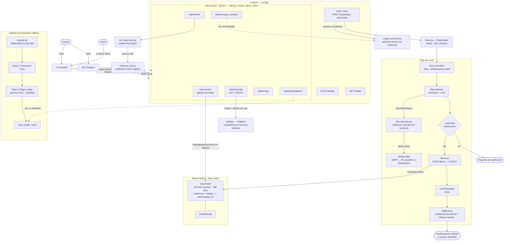
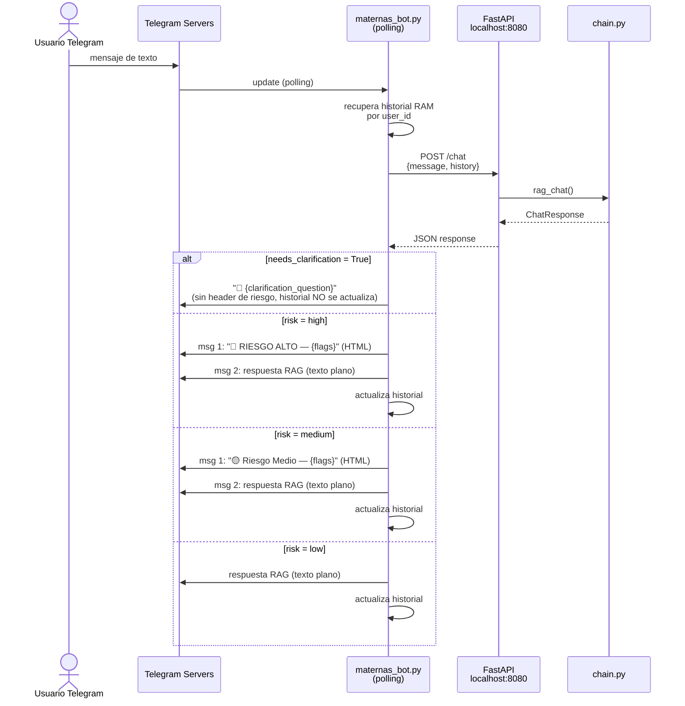
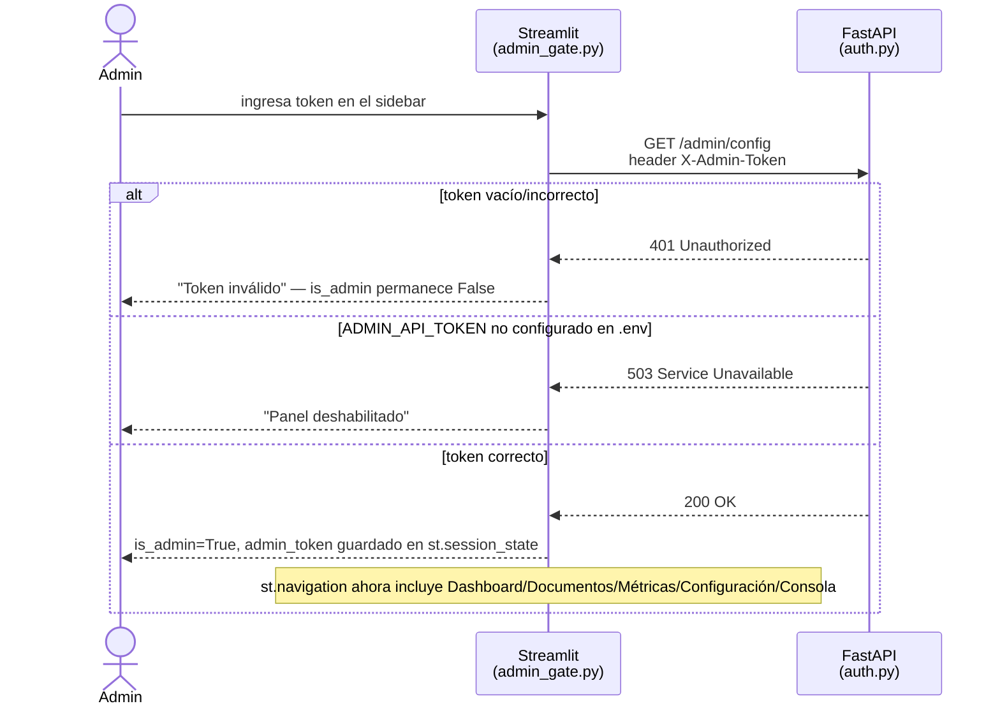
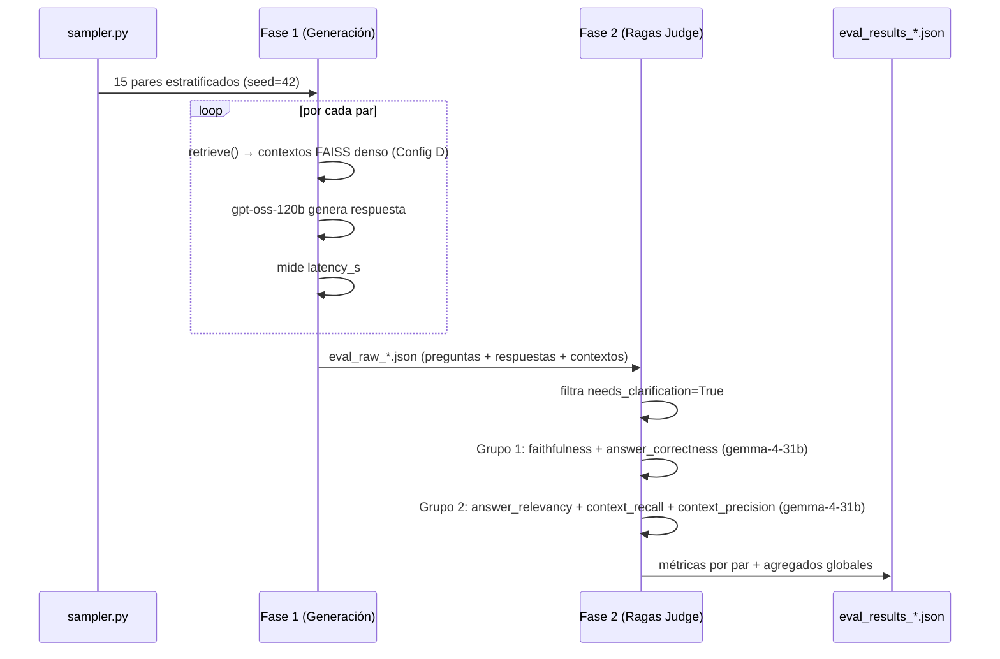
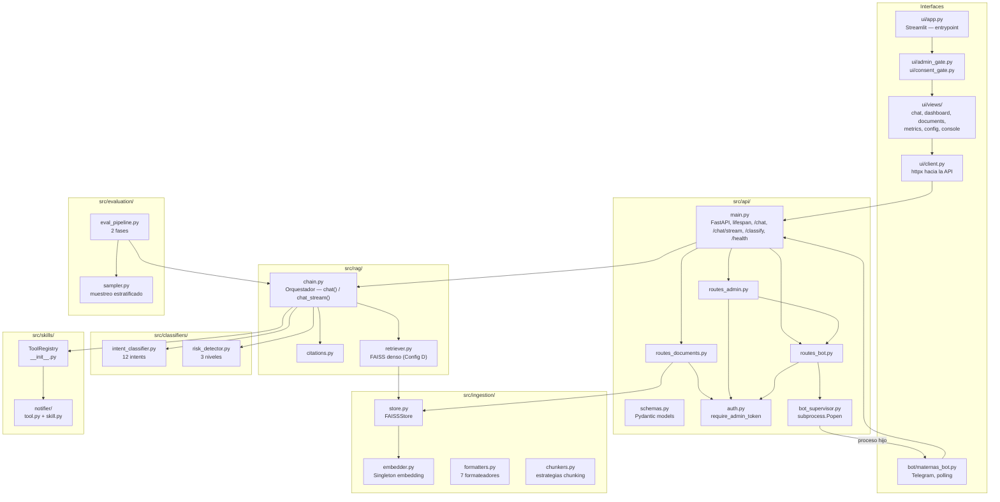
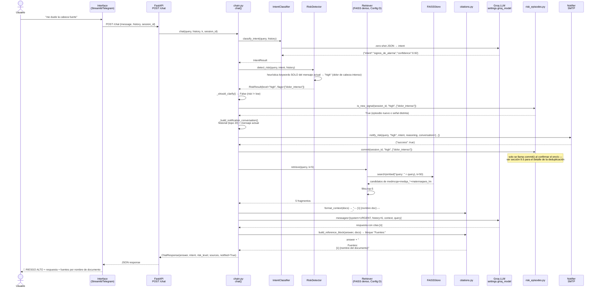
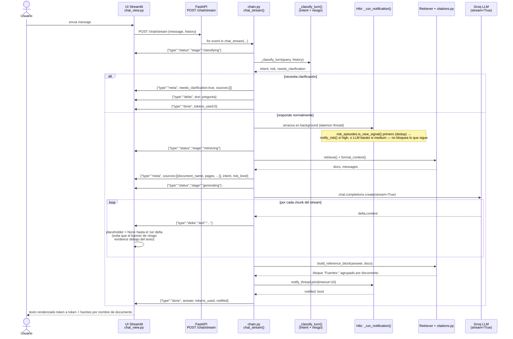
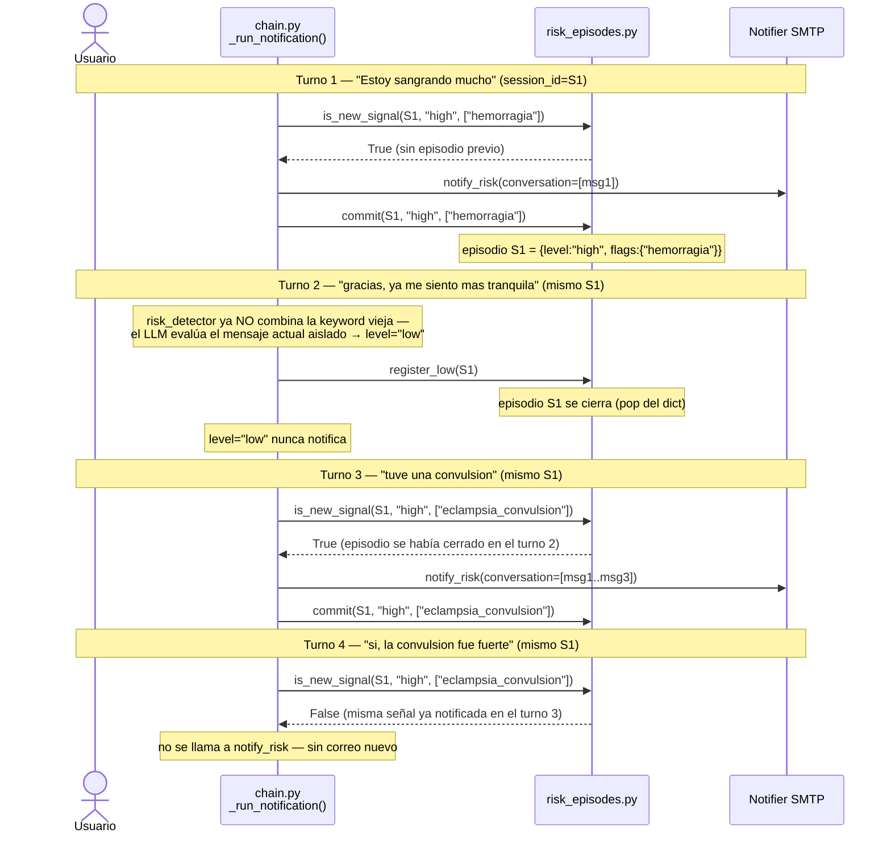
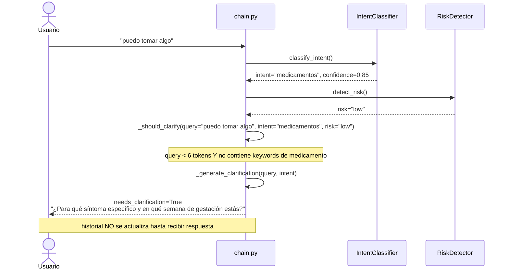
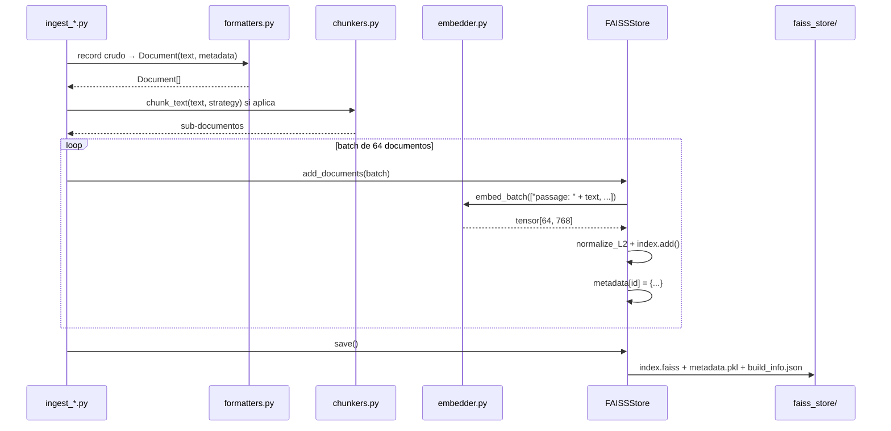

# Maternas-RAG-Chatbot — Documentación Técnica

> **Proyecto:** Maternas-RAG-Chatbot  
> **Convocatoria:** 890 Minciencias · Institución Universitaria de Envigado  
> **Última actualización:** Agosto 2026

> ⚠️ **Nota de actualización:** `textbook` y `multiclinsum_*` fueron
> removidos del índice FAISS por riesgo de licencia (ver `foragents/qa_technical.md`
> Q28/Q31). `src/rag/bm25_index.py` fue eliminado (ya no hay BM25 en producción —
> el retrieval es 100% denso FAISS). La config activa en producción es **Config D**
> (`medmcqa` + `medqa_*` + `maternaqaes_lm`, 253,455 vectores).
>
> **Segunda nota:** desde la nota anterior se agregó un **panel de
> administración completo** (Dashboard, Documentos, Métricas, Configuración,
> Consola — protegido por `X-Admin-Token`), gestión en vivo de documentos del
> índice FAISS (alta/baja/desactivación), **configuración editable en caliente**
> para 10 variables de `.env` (con reinicio administrado del bot de Telegram para
> las que ese proceso solo lee al arrancar), y **streaming token a token** de
> `POST /chat/stream` con citas por nombre de documento en vez de "fragmento
> [n]". Todo esto se documenta en la nueva sección **6 — Panel de
> Administración** y en la sección **12 — API**. `GROQ_MODEL` ya no está
> "parcialmente implementado": los 5 puntos que llaman a Groq (`chain.py` ×4,
> `intent_classifier.py`, `risk_detector.py`) leen `settings.groq_model`, sin
> valores hardcodeados. El proyecto también tiene ahora una suite de tests
> automatizados (`pytest`, `tests/`) — ver sección 14.
>
> **Tercera nota (24-ago-2026):** dos cambios sobre lo anterior. (1) La
> página **Métricas** del panel admin suma una subsección **"Uso en tiempo
> real"**: cuenta sesiones activas de Streamlit/Telegram con su duración y
> tokens consumidos, **sin ningún identificador de sesión ni de usuario** —
> ver `GET /admin/usage_sessions` y `src/api/usage_sessions.py`. (2) Se
> corrigió la notificación de riesgo clínico: la capa heurística y el prompt
> del LLM "contaminaban" turnos posteriores no relacionados con keywords de
> alarma de varios mensajes atrás, reenviando el correo en cada turno
> siguiente; ahora un nuevo módulo `src/rag/risk_episodes.py` deduplica por
> episodio (nivel + categorías de flags, nunca texto clínico, en memoria) y
> el email de alerta incluye la **secuencia completa** de mensajes que llevó
> a la alerta, no solo el que la disparó. Ambos cambios reutilizan el mismo
> `session_id` aleatorio (uuid4, generado por el cliente — nunca derivado de
> un chat_id de Telegram real) que ahora viaja en `POST /chat`/`/chat/stream`.
> Detalle en la sección **6** (Uso en tiempo real) y la nueva sección **9.5**
> (Deduplicación de notificaciones de riesgo).

---

## 1. Portada / Resumen Ejecutivo

### Descripción del proyecto

**Maternas** es un chatbot conversacional basado en Recuperación Aumentada por Generación (RAG) diseñado para responder consultas de salud materna en español. El sistema está orientado a madres gestantes y en período postparto, cubriendo temas como control prenatal, signos de alarma, medicamentos, nutrición, lactancia y salud mental perinatal.

El problema que resuelve es el acceso equitativo a información clínica confiable: en contextos de bajos recursos, las gestantes frecuentemente no tienen acceso rápido a orientación médica ante dudas cotidianas. El chatbot actúa como primer filtro informativo, clasifica la urgencia clínica de cada consulta y —cuando detecta riesgo alto— escala mediante notificaciones por correo electrónico.

La arquitectura está diseñada para operar con costo marginal cercano a cero (APIs gratuitas, modelo de embedding local) y sobre hardware de gama media (RTX 2050, 16 GB RAM), sin fine-tuning ni infraestructura cloud dedicada.

### Stack tecnológico principal

| Capa | Tecnología | Versión |
|---|---|---|
| Lenguaje | Python | 3.12.7 |
| API backend | FastAPI + uvicorn | 0.115.6 / 0.32.1 |
| Interfaz web | Streamlit | 1.41.1 |
| Bot mensajería | python-telegram-bot | 21.10 |
| LLM generador | `openai/gpt-oss-120b` (Groq API) | — |
| LLM evaluador | `gemma-4-31b` (Cerebras API) | — |
| Embedding | `intfloat/multilingual-e5-base` | 768 dims |
| Vector store | FAISS `IndexFlatIP` | 1.9.0 |
| Orquestación LLM | LangChain | 0.3.13 |
| Evaluación | Ragas | 0.2.12 |
| Validación config | Pydantic Settings | 2.14.1 |

---

## 2. Arquitectura General

### Diagrama de alto nivel



> El bot de Telegram consume `POST /chat` (no streaming); solo la UI Streamlit usa `POST /chat/stream`. `EP_DOCS`/`EP_CFG`/`EP_BOTR`/`EP_LOGS`/`EP_EVAL`/`EP_USAGE` están detallados en la sección **6 — Panel de Administración**.

### Descripción de componentes

| Componente | Responsabilidad |
|---|---|
| **Bot Telegram** | Cliente ligero: reenvía mensajes a `POST /chat`, mantiene historial en RAM por usuario, formatea respuestas con badges de riesgo HTML, corre el scheduler de check-ins vía `JobQueue` |
| **UI Streamlit** | Interfaz web multipágina: Chat (público) + Dashboard/Documentos/Métricas/Configuración/Consola (solo admin, gate por `X-Admin-Token`) |
| **FastAPI** | Punto de entrada REST: valida requests con Pydantic, carga FAISS en startup vía `lifespan`, expone endpoints públicos (`/chat`, `/chat/stream`, `/classify`, `/health`) y administrativos (`/documents*`, `/admin*`, protegidos) |
| **chain.py** | Orquestador del turno: intent → risk → clarification check → dedup de episodio + notificación (paralela en streaming) → retrieval → generación → citas. Expone `chat()` y `chat_stream()` sobre la misma lógica compartida, ambos con `session_id` opcional |
| **citations.py** | Nombre legible del documento de origen de cada fragmento citado (`[n]` → bloque `Fuentes:`), en vez de "fragmento [n]" genérico |
| **Intent Classifier** | Clasifica la consulta en 12 categorías (zero-shot JSON vía `settings.groq_model`), con fallback heurístico por keywords |
| **Risk Detector** | Evalúa urgencia clínica en 3 niveles: capa 1 heurística (sin API, 0ms, evalúa solo el mensaje actual), capa 2 LLM si la heurística no detecta nada (sí considera turnos previos, con criterio explícito de aislar mensajes no relacionados) |
| **risk_episodes.py** | Deduplica notificaciones de riesgo por sesión, en memoria: un turno "low" cierra el episodio; medium/high solo renotifica si el riesgo escala o aparece una categoría de flag distinta a la última efectivamente notificada |
| **Retriever** | Búsqueda densa FAISS pura sobre `medmcqa` + `medqa_*` + `maternaqaes_lm` (Config D, producción actual; sin BM25, sin `textbook`/`multiclinsum` — removidos por licencia) |
| **FAISS Store** | Gestiona el índice vectorial en disco: carga, búsqueda, adición de documentos, activación/desactivación, persistencia |
| **Notifier Skill** | Envía alertas por email SMTP cuando se detecta riesgo alto o medio-alto, con la secuencia completa de mensajes que llevó a la alerta (no solo el mensaje que la disparó) |
| **usage_sessions.py** | Registro en memoria de sesiones activas (Streamlit/Telegram) por `session_id` aleatorio: duración y tokens consumidos por sesión, sin ningún dato identificable — alimenta la subsección "Uso en tiempo real" de Métricas |
| **routes_documents.py / routes_admin.py / routes_bot.py** | Endpoints del panel: gestión de documentos, evaluaciones + configuración editable + logs, y control del bot, cada uno protegido por `require_admin_token` a nivel de router |
| **bot_supervisor.py** | Arranca/detiene/reinicia `maternas_bot.py` como subproceso hijo de la API; expone estado (pid, uptime, `crashed`) y buffer de logs en memoria |
| **eval_pipeline.py** | Pipeline de evaluación en dos fases con modelos independientes; calcula 5 métricas Ragas + latencia |

---

## 3. Estructura del Proyecto

```
maternas-rag/
├── src/                          # Código fuente principal
│   ├── settings.py               # Configuración central (Pydantic Settings, lee .env)
│   ├── api/
│   │   ├── main.py               # FastAPI app: lifespan, /chat, /chat/stream, /classify, /health
│   │   ├── schemas.py            # Modelos Pydantic de request/response
│   │   ├── auth.py               # require_admin_token(): valida X-Admin-Token (fail-closed)
│   │   ├── routes_documents.py   # /documents* — gestión en vivo del índice FAISS
│   │   ├── routes_admin.py       # /admin/evaluations*, /admin/config (GET+PATCH), /admin/logs, /admin/usage_sessions
│   │   ├── routes_bot.py         # /admin/bot/* — mapeo HTTP de bot_supervisor.py
│   │   ├── bot_supervisor.py     # Arranca/detiene maternas_bot.py como subproceso hijo
│   │   └── usage_sessions.py     # Sesiones activas en memoria (Streamlit/Telegram), anonimizado
│   ├── rag/
│   │   ├── chain.py              # Orquestador principal del turno RAG (chat() + chat_stream())
│   │   ├── citations.py          # Nombre legible de fuentes citadas ([n] → "Fuentes:")
│   │   ├── risk_episodes.py      # Dedup de notificaciones de riesgo por episodio (en memoria)
│   │   ├── retriever.py          # Config activa (= configD actualmente — producción)
│   │   ├── retriever_configA.py  # [histórico] FAISS puro — baseline
│   │   ├── retriever_configB.py  # [histórico] FAISS+BM25
│   │   ├── retriever_configC.py  # [histórico] FAISS+BM25+corpus ES
│   │   └── retriever_configD.py  # medmcqa+medqa_*+maternaqaes_lm, sin textbook/multiclinsum (licencia)
│   ├── classifiers/
│   │   ├── intent_classifier.py  # Clasificación en 12 intents (LLM + heurística)
│   │   └── risk_detector.py      # Detección de riesgo en 3 niveles (reglas + LLM)
│   ├── ingestion/
│   │   ├── store.py              # FAISSStore: CRUD sobre el índice vectorial
│   │   ├── embedder.py           # Singleton del modelo de embedding
│   │   ├── formatters.py         # 7 formateadores de datasets a Document
│   │   ├── chunkers.py           # Estrategias de chunking por tipo de fuente
│   │   ├── ingest_medmcqa.py     # Script de ingesta MedMCQA
│   │   ├── ingest_medqa.py       # Script de ingesta MedQA + Textbooks
│   │   ├── ingest_multiclinsum.py# Script de ingesta MultiClinSum
│   │   ├── ingest_maternaqaes_lm.py # Script de ingesta MaternaQA-es LM
│   │   └── run_ingestion.py      # Orquestador: corre todos los scripts
│   ├── evaluation/
│   │   ├── eval_pipeline.py      # Pipeline 2 fases: generación + Ragas
│   │   └── sampler.py            # Muestreo estratificado de MaternaQA-es
│   ├── bot/
│   │   ├── maternas_bot.py       # Bot Telegram (polling)
│   │   └── active_users.py       # Registro cifrado (Fernet) para el scheduler de check-ins
│   ├── ui/
│   │   ├── app.py                # Entrypoint Streamlit: gates, sidebar, st.navigation
│   │   ├── client.py             # Cliente HTTP hacia la API (sin lógica de presentación)
│   │   ├── admin_gate.py         # Desbloquea las páginas admin dentro de la sesión (X-Admin-Token)
│   │   ├── consent_gate.py       # Exige el aviso de tratamiento de datos antes de usar cualquier página
│   │   └── views/                # chat, dashboard, documents, metrics, config, console
│   └── skills/
│       ├── __init__.py           # ToolSpec, ToolRegistry, Skill base
│       └── notifier/
│           ├── skill.py          # NotifierSkill con ToolSpec
│           └── tool.py           # notify_risk(): envío SMTP
├── docs/                         # Documentación técnica e informes
│   └── DOCUMENTACION.md
├── foragents/                    # Contexto técnico para agentes IA
│   ├── technical_plan.md         # Plan técnico completo aprobado
│   ├── qa_technical.md           # 27 preguntas técnicas resueltas
│   ├── eval_runbook.md           # Guía operacional de evaluación
│   ├── eval_setup_critico.md     # Setup crítico del pipeline de evaluación
│   ├── retrieval_arquitecturas_configs.md
│   ├── project_constraints.md
│   └── test_cases.md
├── evaluation_reports/           # Resultados de evaluación (gitignored)
├── faiss_store/                  # Índice FAISS compilado (gitignored)
├── datasets/                     # Datasets crudos (gitignored)
├── logs/                         # Logs de API e ingesta (gitignored)
├── no_repo/                      # Documentos internos no versionados (gitignored)
├── requirements.txt
├── .env.example
├── .gitignore
└── README.md
```

### Convención de organización

El proyecto sigue una **arquitectura en capas verticales** por dominio funcional:
- `ingestion/` → construcción del índice (one-time)
- `rag/` → retrieval + generación (runtime crítico)
- `classifiers/` → clasificación de intención y riesgo (pre-RAG)
- `api/` → exposición HTTP
- `ui/` + `bot/` → interfaces de usuario
- `skills/` → herramientas extensibles (patrón registry)
- `evaluation/` → métricas automáticas (offline)

No se usa MVC ni hexagonal. La dependencia es unidireccional: `api → chain → classifiers + retriever + skills → store + embedder`.

---

## 4. Repositorios de GitHub Usados

El proyecto consume datasets de repositorios públicos de GitHub. Se accede a ellos directamente por descarga HTTP (no como dependencias de código).

| Repositorio | URL | Por qué se usó | Qué parte se ingesta |
|---|---|---|---|
| **JhonHander/MaternaQA-es** | `github.com/JhonHander/MaternaQA-es` | Único benchmark público de QA obstétrico en español. Provee corpus LM (train/val/test) y 328 pares QA para evaluación del sistema. Es el dataset más alineado con el dominio objetivo. | `datasets/obstetrics/lm/train_lm.jsonl`, `validation_lm.jsonl`, `test_lm.jsonl` (corpus LM) y `qa_flat_jsonl/test.jsonl` (benchmark de evaluación) |
| **minciencias-maternas/MaternaQA-es** | `github.com/minciencias-maternas/MaternaQA-es` | Mirror del repositorio anterior bajo la organización del proyecto Minciencias. Se usa como fuente primaria para la descarga del corpus LM. | Mismos archivos JSONL que el anterior |

### Importancia para el proyecto

El corpus **MaternaQA-es LM** (5 353 sub-chunks tras re-chunking) es el único dataset en español específico de obstetricia colombiana en el índice. Su incorporación incrementó `context_recall` de 0.000 a 0.452 y `faithfulness` de 0.228 a 0.456 al comparar Config B vs Config C v3. Sin este corpus, el sistema responde desde conocimiento médico general en inglés.

El split `test.jsonl` del benchmark (328 pares QA) se usa exclusivamente para evaluación: no se ingesta al índice en condiciones normales para evitar data leakage. Los 3 PDFs fuente del benchmark (`GPC-Atencion-Prenatal-de-Bajo-Riesgo-2023.pdf`, `vol831-1.pdf`, `4142_stamped.pdf`) están representados solo a través de sus fragmentos JSONL pre-procesados.

---

## 5. Integración con Telegram

### Descripción general

El bot de Telegram (`src/bot/maternas_bot.py`) es una interfaz conversacional que permite a los usuarios interactuar con el chatbot Maternas directamente desde la app de mensajería. Opera en modo **polling** y actúa como cliente ligero: toda la lógica RAG, clasificación de intención y detección de riesgo reside en la API FastAPI; el bot solo gestiona la sesión de Telegram y el formato de los mensajes.

### Arquitectura de la integración



### Decisiones de diseño

**Dos mensajes separados (header HTML + cuerpo texto plano):** Telegram tiene un parser de Markdown propio que entra en conflicto con el formato que genera el LLM (citas `[n]`, listas, negritas anidadas). Intentar enviar todo en un solo mensaje con `parse_mode=Markdown` produce `BadRequest` frecuentes. La solución implementada es enviar primero un mensaje HTML con el badge de riesgo y luego la respuesta del LLM en texto plano sin `parse_mode`.

**Historial en RAM por `user_id`:** El bot mantiene un diccionario `histories: dict[int, list[dict]]` en memoria. El historial es volátil — se pierde al reiniciar el proceso. Para producción se requeriría persistencia en SQLite o Redis.

**Clarification no actualiza el historial:** Cuando el chatbot emite una pregunta de clarificación (`needs_clarification=True`), el par no se registra en el historial conversacional. La siguiente query del usuario llega sin ese intercambio intermedio, evitando que la pregunta de clarificación rompa el contexto del historial.

**Dependencia de la API:** El bot requiere que FastAPI esté corriendo en `localhost:8080` antes de iniciarse. No tiene lógica de retry ante API caída; falla silenciosamente con un mensaje de error al usuario.

### Comandos disponibles

| Comando | Descripción |
|---|---|
| `/start` | Bienvenida con lista de temas que cubre el chatbot |
| `/help` | Instrucciones detalladas de uso (formato Markdown) |
| `/reset` | Borra el historial conversacional del usuario |
| `/stats` | Consulta `GET /health` y muestra vectores indexados, modelo activo y estado de FAISS |

### Configuración

```env
TELEGRAM_BOT_TOKEN=<token-de-BotFather>
```

El token se obtiene creando un bot en [@BotFather](https://t.me/botfather) con el comando `/newbot`. El bot se arranca con:

```bash
# Requiere la API FastAPI corriendo en localhost:8080
python src/bot/maternas_bot.py
```

### Limitaciones

- Historial volátil en RAM — se pierde al reiniciar
- Sin manejo de imágenes, archivos ni comandos de voz
- Sin retry ante fallos de la API FastAPI
- No soporta grupos de Telegram, solo chats individuales

---

## 6. Panel de Administración

### Descripción general

El panel de administración vive dentro de la misma app de Streamlit (`src/ui/app.py`), como páginas adicionales que solo aparecen si la sesión del navegador se autenticó como admin. No es un proceso ni un puerto separado — reutiliza la API FastAPI existente bajo los prefijos `/documents*` y `/admin*`, todos protegidos por el mismo header `X-Admin-Token`.

| Página | Contenido | Llamadas a la API |
|---|---|---|
| **Dashboard** | Resumen de sesión: estado de la API, vectores indexados, mensajes de la sesión actual | Ninguna (lee `st.session_state`) |
| **Documentos** | Centro de gestión documental: listar/buscar, ver detalle paginado de fragmentos, activar/desactivar, subir `.txt` nuevo | `/documents*` |
| **Métricas** | Visor de corridas de evaluación Ragas ya generadas (no recomputa nada) + subsección "Uso en tiempo real" (sesiones activas anonimizadas) | `/admin/evaluations*`, `/admin/usage_sessions` |
| **Configuración** | Config efectiva del backend (solo lectura) + formulario editable para 10 variables de `.env` | `/admin/config` (GET+PATCH) |
| **Consola** | Estado/logs de la API y del bot de Telegram, con control de arranque del bot | `/admin/logs`, `/admin/bot/*` |

### Autenticación (`X-Admin-Token`)



Puntos de diseño (`src/api/auth.py`, `src/ui/admin_gate.py`):

- **Fail-closed:** sin `ADMIN_API_TOKEN` en `.env`, el panel responde `503` en vez de quedar abierto — un `.env` incompleto nunca degrada en silencio a "cualquiera con el puerto puede administrar".
- **Comparación en tiempo constante** (`hmac.compare_digest`) para no filtrar el token por timing.
- **La UI valida contra la API real**, no contra `settings.admin_api_token` leído en el proceso de Streamlit — así UI y API corriendo con `.env` distintos nunca autentican por error, y no se duplica la lógica de comparación.
- **`admin_token` vive solo en `st.session_state`** (nunca en una variable de módulo): en modo servidor Streamlit un proceso atiende sesiones concurrentes de distintos usuarios; una variable de módulo filtraría el token de un admin autenticado a cualquier otra sesión.
- **Páginas ocultas, no solo invisibles:** `st.navigation` solo puede resolver páginas presentes en la lista que recibe; una sesión sin `is_admin` nunca las recibe, así que quedan inalcanzables incluso por URL directa, no solo fuera del menú.
- Protege también las **lecturas**: `GET /documents/{doc_id}` devuelve texto completo del corpus y CORS es abierto (`allow_origins=["*"]`) — sin auth, un listado sería un volcado scriptable del material, el mismo cuyo licenciamiento el proyecto ya tuvo que limpiar una vez (ver nota de licencias arriba).

### Gestión de documentos (`/documents*`, `src/api/routes_documents.py`)

Opera sobre el mismo `FAISSStore` singleton que sirve `/chat` (nunca una copia propia con `FAISSStore.load()`, que dejaría al servidor sirviendo vectores viejos mientras un `save()` posterior revierte cambios en silencio).

| Endpoint | Qué hace |
|---|---|
| `GET /documents` | Lista documentos agregados por `doc_id` (no por vector), con búsqueda y paginación |
| `GET /documents/stats` | Vectores totales, cantidad de documentos, caracteres totales, fecha de build del índice |
| `GET /documents/{doc_id}` | Detalle paginado de los fragmentos de un documento (texto completo por chunk) |
| `PATCH /documents/{doc_id}` | Activa/desactiva **todos** los fragmentos del documento |
| `POST /documents/upload` | Sube un `.txt`, lo chunkea y lo indexa en caliente |

Decisiones relevantes:

- **Vista agregada cacheada por versión, no por TTL** (`_index_view`): `store.metadata` tiene cientos de miles de entradas; recorrerlo entero en cada request de la UI (que pide lista + stats juntos) sería dos barridos O(N) por click. Se cachea con clave `(id(store), store.total, store.mutation_seq)` — un TTL seguiría reportando "activo" un rato después de que un admin lo desactivó, el peor fallo posible para un control de compliance.
- **`active`/`has_chunks` se agregan sobre TODOS los chunks del documento** (AND/OR), no se toman del primero que aparece — evita reportar un estado arbitrario para un documento a medio activar/desactivar.
- **Desactivar ≠ borrar:** `PATCH` marca los chunks como inactivos (excluidos del retrieval) sin tocar el índice FAISS ni renumerar vectores; si falla `save_metadata()` tras la mutación en memoria, se revierte en memoria para no divergir de lo que quedó en disco.
- **Límites de upload acotan CHUNKS, no solo bytes** (`MAX_UPLOAD_CHUNKS=400`, `MAX_UPLOAD_BYTES=2MB`): el embedding corre síncrono dentro del request sobre CPU, y lo que define el tiempo real es cuántos chunks hay que vectorizar, no el tamaño del archivo.
- **Solo `.txt` sin ruta en el nombre** — mitigación adicional al hecho de que el proyecto ya tuvo que remover `textbook`/`multiclinsum` del índice por licenciamiento (ver nota arriba): un upload abierto reabriría ese riesgo por otra puerta. El token admin y la etiqueta de fuente visible en cada cita son las mitigaciones.
- **Sin TOCTOU:** la verificación de `doc_id` duplicado ocurre dentro del mismo `store.write_lock()` que hace el `add_documents()`, no antes.

### Métricas de evaluación (`/admin/evaluations*`)

Solo lectura: lee los reportes JSON que `src/evaluation/eval_pipeline.py` ya generó en `evaluation_reports/`, sin recomputar nada. `run_id` se resuelve contra una ruta validada dentro de `evaluation_reports/` (rechaza intentos de path traversal tipo `../../secrets`).

### Uso en tiempo real (`/admin/usage_sessions`, `src/api/usage_sessions.py`)

Subsección nueva de **Métricas**: dos tarjetas KPI (sesiones activas en Streamlit / Telegram) + una tabla por plataforma con **Duración activa** y **Tokens usados** por sesión.

**Cómo se identifica una sesión, sin identificar a la persona:** el cliente (Streamlit o el bot de Telegram) genera un `session_id` aleatorio (`uuid4`) — **nunca derivado del `chat_id` real de Telegram ni de ningún dato identificable** — y lo manda en el campo `session_id` de `POST /chat`/`POST /chat/stream`. El backend lo usa solo como clave de un dict en memoria (`{platform, started_at, last_activity, tokens_total}`); una sesión sin turnos nuevos en 15 minutos deja de contarse como activa. `GET /admin/usage_sessions` devuelve la vista ya anonimizada: **nunca el `session_id`, ni un hash, ni ningún derivado de él** — solo `platform`, `active_seconds` y `tokens_total` por fila, sin ninguna columna ni orden estable entre refrescos que pudiera actuar como identificador. Igual que `histories` en el bot de Telegram, es puramente en memoria: se pierde al reiniciar la API — suficiente para una vista de monitoreo en vivo, no una métrica histórica.

**Streamlit:** el `session_id` se genera una vez por sesión de navegador (`st.session_state.session_id` en `app.py`). Un refresh duro del navegador crea una sesión de Streamlit nueva desde cero, así que también genera un `session_id` nuevo — limitación conocida, no solucionable sin cookies/localStorage (ver sección 17).

**Telegram:** el `session_id` se genera por conversación y se regenera en `/start` y `/reset` — la sesión de uso anterior deja de recibir turnos y expira sola por inactividad, sin necesidad de una señal explícita de "fin de sesión" hacia el backend.

Este mismo `session_id` también alimenta la deduplicación de notificaciones de riesgo por episodio — ver sección **9.5**.

### Configuración editable (`/admin/config`, `src/api/routes_admin.py`)

10 variables de `.env` se pueden editar desde la página **Configuración**, sin editar el archivo a mano ni reiniciar procesos por terminal:

| Variable | Aplica |
|---|---|
| `GROQ_MODEL`, `GROQ_API_KEY` | En caliente, sin reiniciar nada |
| `NOTIFIER_ENABLED`, `NOTIFIER_EMAIL_TO`, `NOTIFIER_SMTP_USER`, `NOTIFIER_SMTP_PASSWORD` | En caliente, sin reiniciar nada |
| `TELEGRAM_BOT_TOKEN`, `STATUS_CHECK_INTERVAL_LOW/MEDIUM/HIGH_SECONDS` | Requiere reiniciar el bot (botón "Reiniciar bot ahora" en la misma respuesta) |

**Por qué la mitad aplica en caliente y la otra mitad no:** son 3 procesos independientes en la misma máquina (API, UI Streamlit, bot de Telegram). Los primeros 6 campos los lee el propio proceso de la API en el momento de usarlos (`notify_risk()` lee `settings.notifier_*` en cada llamada; los 5 puntos que llaman a Groq leen `settings.groq_model` en cada llamada) — mutar el singleton `settings` en memoria (`setattr(settings, campo, valor)`) se ve al instante desde cualquier módulo que hizo `from src.settings import settings`, porque todos comparten el mismo objeto. `GROQ_API_KEY` es la excepción dentro de ese grupo: se usa para construir un cliente `Groq(api_key=...)` cacheado por separado en `chain.py`, `intent_classifier.py` y `risk_detector.py` — por eso cambiarla también dispara `reset_client()` en los tres, para que el próximo uso reconstruya el cliente con la key nueva. Los últimos 4 campos los lee únicamente el proceso del bot al arrancar (`Settings()` a nivel de módulo, otro intérprete de Python) — mutar el `settings` de la API no le llega; la única forma de que apliquen es que el bot **vuelva a arrancar**, de ahí que la respuesta del `PATCH` incluya `requires_bot_restart` y la UI ofrezca reiniciarlo ahí mismo.

**Persistencia y endurecido contra inyección** (revisado explícitamente, dado que el endpoint escribe en `.env`):

- `PATCH /admin/config` **no acepta un nombre de variable libre**: expone un campo Pydantic fijo por variable (`model_config = {"extra": "forbid"}`), así que no existe forma de pedirle que toque `ADMIN_API_TOKEN` ni ninguna otra variable fuera de esa lista — un campo desconocido es `422`, no se ignora en silencio.
- La escritura usa `dotenv.set_key()` (ya dependencia del proyecto vía `pydantic-settings`) en vez de concatenar texto a mano.
- Cualquier valor con `\n`/`\r` se rechaza antes de escribir (`400`) — segunda barrera contra inyectar una línea nueva en el archivo (p. ej. `"x\nADMIN_API_TOKEN=y"`, que en la próxima lectura definiría una variable aparte).
- Los 3 secretos (`groq_api_key`, `notifier_smtp_password`, `telegram_bot_token`) **nunca se devuelven en ninguna respuesta**, ni en el `GET` ni en el `PATCH` — solo viaja un booleano "configurado" (`secrets_configured`), el mismo patrón que ya existía antes de que la escritura fuera posible.
- Los cambios se loguean por **nombre de campo, nunca por valor** (`logger.info("Variables actualizadas: %s", changed)`).

### Bot de Telegram como subproceso administrado (`src/api/bot_supervisor.py`)

El bot se puede iniciar, detener y reiniciar desde la página **Consola**: la API lo lanza como subproceso hijo (`subprocess.Popen([sys.executable, "src/bot/maternas_bot.py"], ...)`), con PID, hora de inicio, uptime y un buffer de log en memoria (hilo lector aparte, `deque(maxlen=1000)`). Estado y buffer son singletons de módulo protegidos por un lock, para que dos clicks seguidos de "Reiniciar" no lancen dos procesos del bot a la vez. Al apagar la API (`lifespan()` en `main.py`) se detiene también el subproceso del bot, para no dejarlo huérfano.

**Distinción crasheado vs. detenido a propósito:** en Windows, `Popen.terminate()` llama a `TerminateProcess` — no hay señal SIGTERM real, y el proceso queda con un `exit_code` no nulo (típicamente 1) **igual que** un `sys.exit(1)` por token de Telegram inválido. Sin una bandera adicional, apretar "Detener" se vería en la consola idéntico a un crash real. `bot_supervisor.status()` expone `crashed: bool` — `True` solo si el proceso terminó por su cuenta, `False` si lo detuvo un admin, aunque el `exit_code` numérico sea el mismo en ambos casos.

### Consola (`GET /admin/logs`, `/admin/bot/*`)

Dos paneles de solo estado, con refresco **manual** (botón "Actualizar", sin auto-poll — consistente con que el resto del panel tampoco se refresca solo):

- **API:** uptime del proceso y últimas líneas de log. `GET /admin/logs` lee un buffer en memoria (`deque(maxlen=1000)`) alimentado por un `logging.Handler` colgado del logger raíz desde el arranque de `main.py`. No tiene control de reinicio — auto-reiniciar el propio proceso que atiende la request es frágil (requeriría algo como `os.execv`) y de bajo valor cuando quien arrancó `uvicorn` ya lo controla por terminal; esto queda documentado como **fuera de alcance a propósito** en `main.py`.
- **Bot de Telegram:** badge de estado (🟢 corriendo / 🔴 detenido / ⚠️ se cerró solo), PID, uptime, botones Iniciar/Detener/Reiniciar y sus últimas líneas de log.

---

## 7. Evaluación del Agente con Ragas

### Marco de evaluación

El sistema se evalúa con el framework **Ragas** sobre el benchmark **MaternaQA-es** (split test, 328 pares QA de obstetricia en español). La evaluación opera en **dos fases independientes** para evitar que el mismo modelo evalúe sus propias respuestas.



### Métricas calculadas

| Métrica | Qué mide | Rango |
|---|---|---|
| `faithfulness` | Fracción de afirmaciones de la respuesta verificables en los fragmentos recuperados | 0–1 |
| `answer_correctness` | Similitud semántica y factual de la respuesta vs. el ground truth | 0–1 |
| `answer_relevancy` | Si la respuesta aborda directamente la pregunta formulada | 0–1 |
| `context_recall` | Si el retrieval capturó los fragmentos necesarios para responder (vs. ground truth) | 0–1 |
| `context_precision` | Proporción de fragmentos recuperados que son realmente útiles | 0–1 |
| `latency_s` | Tiempo end-to-end por par (embedding + FAISS + clasificadores + LLM) | segundos |

### Resultados por configuración

| Config | N | Faithfulness | Ans. Correct. | Ans. Relev. | Ctx. Recall | Ctx. Prec. | Lat. (s) |
|---|---|---|---|---|---|---|---|
| A — FAISS puro | 15 | 0.162 | 0.350 | 0.635 | 0.000 | 0.000 | 11.35 |
| B — FAISS+BM25 | 15 | 0.228 | 0.338 | 0.631 | 0.000 | 0.000 | 10.36 |
| C v1 — +LM 879tok | 15 | 0.133 | 0.378 | 0.691 | 0.033 | 0.143 | 10.26 |
| C v2 — +LM 336tok | 15 | 0.359 | 0.337 | 0.631 | 0.067 | 0.083 | 10.10 |
| **C v3 — +test+noclarif** | **14** | **0.456** | **0.532** | **0.816** | **0.452** | **0.388** | **10.23** |
| Baseline MaternaQA-es | — | 0.713 | — | 0.558 | — | — | — |

> `answer_relevancy` de Config C v3 (**0.816**) supera el baseline publicado (0.558).

### Configuración del judge

| Aspecto | Decisión | Razón |
|---|---|---|
| Modelo judge | `gemma-4-31b` (Cerebras) | Sin límite diario de tokens, JSON válido consistente, ~296 tok/par |
| `max_workers` | 1 | Evita ráfagas concurrentes que agotan cuotas gratuitas |
| `batch_size` | 1 | Procesamiento secuencial, predecible |
| `is_finished_parser` | Permisivo (acepta `"length"`) | Evita `LLMDidNotFinishException` en respuestas largas en español |
| Filtro clarificación | `needs_clarification=True` excluido | Las preguntas de clarificación tienen `faithfulness=0` por definición |

---

## 8. Componentes / Módulos del Sistema

### Diagrama de componentes



### Por módulo

#### `src/settings.py`
Instancia global `settings` de Pydantic Settings. Lee `.env` al importar. Todas las claves de API, rutas y parámetros del sistema se centralizan aquí. Es un singleton mutable: `PATCH /admin/config` (ver sección 6) hace `setattr(settings, campo, valor)` sobre esta misma instancia, visible al instante en todos los módulos que la importaron.

#### `src/api/main.py`
Punto de entrada de la aplicación. Carga el índice FAISS en `lifespan` (startup) y detiene el subproceso del bot si está corriendo (shutdown). CORS abierto a `*` (pendiente de restringir en producción). Expone los 4 endpoints públicos (`/health`, `/chat`, `/chat/stream`, `/classify`) y registra los 3 routers administrativos (`documents_router`, `admin_router`, `bot_router`); también mantiene el buffer de logs en memoria (`_log_buffer`) que alimenta `GET /admin/logs`. `/chat` y `/chat/stream` llaman a `usage_sessions.touch()` con el `session_id`/`platform` del request y pasan `session_id` a `rag_chat()`/`rag_chat_stream()`.

#### `src/api/auth.py`, `routes_documents.py`, `routes_admin.py`, `routes_bot.py`
La auth (`require_admin_token`, header `X-Admin-Token`, fail-closed) se declara una sola vez por router — un endpoint nuevo bajo `/documents*` o `/admin*` no puede quedar sin proteger por descuido. `routes_documents.py` gestiona el índice en caliente; `routes_admin.py` expone evaluaciones (solo lectura), configuración editable (`GET`/`PATCH /admin/config`), logs de la API y `GET /admin/usage_sessions`; `routes_bot.py` es el mapeo HTTP delgado sobre `bot_supervisor.py`. Detalle completo en la sección 6.

#### `src/api/bot_supervisor.py`
Arranca/detiene/reinicia `bot/maternas_bot.py` como subproceso hijo (`subprocess.Popen`), con un hilo lector volcando su stdout a un buffer en memoria. Estado protegido por lock (evita dos procesos concurrentes ante doble click). Distingue `crashed` (terminó solo) de detención manual — necesario en Windows, donde `Popen.terminate()` no deja rastro de señal real.

#### `src/api/usage_sessions.py`
Registro en memoria (dict + lock) de sesiones activas por `session_id`: `{platform, started_at, last_activity, tokens_total}`. `touch()` se llama en cada turno de `/chat`/`/chat/stream`; `active_by_platform()` poda las sesiones inactivas por más de `IDLE_TIMEOUT_SECONDS` (15 min) y devuelve la vista agrupada por plataforma, ordenada por duración descendente. Nunca expone el `session_id`. Ver sección 6 (Uso en tiempo real).

#### `src/rag/chain.py`
Módulo más crítico del sistema. Implementa el flujo completo de un turno conversacional (clasificar → detectar riesgo → clarificación → dedup de episodio + notificar → recuperar → generar → citar), compartido entre `chat()` (respuesta única) y `chat_stream()` (generador de eventos NDJSON, notificación en hilo aparte para no bloquear los `delta`). Gestiona el historial (últimos 6 turnos) y construye el system prompt dinámico según nivel de riesgo. Ambas funciones aceptan `session_id` opcional, que pasan a `_run_notification()` para deduplicar por episodio (ver `risk_episodes.py` abajo) y usan para armar la secuencia de mensajes del email de alerta (`_build_notification_conversation()`, historial + mensaje actual, tope `NOTIFICATION_HISTORY_CAP=20`). El singleton de Groq (`_groq_client`) se inicializa en el primer uso y se puede forzar a reconstruir con `reset_client()` (usado cuando `GROQ_API_KEY` cambia en caliente).

#### `src/rag/risk_episodes.py`
Deduplica notificaciones de riesgo por sesión, en memoria (mismo criterio que `usage_sessions.py`, definido aparte para no invertir la dirección de dependencia entre capas — `src/rag/` nunca importa de `src/api/`). API de dos fases: `is_new_signal()` es de solo lectura (decide si vale la pena seguir evaluando, y para riesgo medio si vale la pena llamar al LLM de decisión); `commit()` se llama únicamente cuando el correo **ya se envió de verdad** — así un riesgo medio que el LLM termina descartando no queda marcado como notificado. `register_low()` cierra el episodio de inmediato ante un turno de riesgo bajo. Sin `session_id` (llamadas internas/eval) no hay forma de deduplicar y se preserva el comportamiento de notificar siempre que el nivel lo amerite. Detalle en la sección **9.5**.

#### `src/rag/citations.py`
Separado de `retriever.py` a propósito (ese archivo es un snapshot intercambiable entre configs — ver docstring de `retriever.py`). Resuelve el nombre legible del documento de origen de cada fragmento (`document_name()`), su localizador de página (`document_locator()`) y arma el bloque final `Fuentes:` agrupando citas `[n]` por documento (`build_reference_block()`). `chain.py` llama primero a `normalize_citation_brackets()` sobre la respuesta completa: `gpt-oss-120b` cita de forma intermitente con corchetes CJK de ancho completo (`【1】`) en vez de ASCII (`[1]`), y sin esta normalización `build_reference_block()` no reconoce esas citas y el bloque `Fuentes:` se pierde en silencio (hallazgo documentado en `qa_technical.md` Q34).

#### `src/rag/retriever.py` (y variantes históricas A/B/C/D/E)
Config activa en producción: **Config D**, búsqueda 100% densa FAISS sobre `medmcqa` + `medqa_*` + `maternaqaes_lm` (sin BM25, sin `textbook`/`multiclinsum`). La separación en archivos independientes permite intercambiar arquitecturas copiando el archivo deseado sobre `retriever.py`; todas comparten la misma interfaz pública `retrieve(query, k, k_bm25=0)` / `format_context(docs, max_chars)` — `k_bm25` se conserva en la firma por compatibilidad con las variantes históricas que sí usaban BM25, aunque Config D lo ignora.

#### `src/classifiers/intent_classifier.py`
Clasificador zero-shot. 12 intents válidos. Tres niveles de fallback garantizan que siempre devuelva un intent válido, incluso sin conexión a Groq.

#### `src/classifiers/risk_detector.py`
Dos capas de detección. La capa heurística (diccionarios de keywords por categoría de riesgo) evalúa **solo el mensaje actual** — no consume tokens, latencia ~0ms, y no se combina con el historial (antes sí lo hacía, lo que "contaminaba" turnos posteriores no relacionados: una keyword de alarma en un turno viejo seguía matcheando en cada turno siguiente). Solo cuando la heurística no detecta nada se llama al LLM, que sí considera los últimos `RISK_HISTORY_USER_TURNS=2` turnos previos de la usuaria, pero con instrucción explícita (en el `SYSTEM_PROMPT` y en el prompt por-mensaje) de evaluar el mensaje actual aislado cuando no tiene relación clínica con lo anterior. El LLM reutiliza el mismo vocabulario de categorías de `flags` que la heurística (`_KNOWN_FLAG_CATEGORIES`), para que ambas capas sean comparables por `risk_episodes.py`.

#### `src/ingestion/store.py`
`FAISSStore` encapsula `faiss.IndexFlatIP` con 768 dimensiones. La normalización L2 implícita convierte el producto interno en similitud coseno. Gestiona dos archivos en disco: `index.faiss` y `metadata.pkl` con el texto y metadatos de cada vector, además de `active`/`mutation_seq` para el panel de administración (activación/desactivación de documentos sin renumerar vectores).

#### `src/ingestion/embedder.py`
Singleton de `SentenceTransformer('intfloat/multilingual-e5-base')`. Requiere prefijos `"query: "` para queries y `"passage: "` para documentos (mandatorio en multilingual-e5, ver Q5 en `qa_technical.md`). Se carga en CUDA si `EMBEDDING_DEVICE=cuda`.

#### `src/skills/`
Sistema extensible de herramientas. `ToolRegistry` es un dict de clase que permite registrar y ejecutar tools por nombre. `NotifierSkill` se auto-registra al importar `src.skills.notifier`. Para añadir una nueva skill: crear `src/skills/mi_skill/`, heredar de `Skill`, registrar en `chain.py`. `notify_risk()` (`notifier/tool.py`) acepta un parámetro opcional `conversation: list[dict]` — la secuencia de turnos que llevó a la alerta, armada por `chain.py`; el cuerpo del email la lista completa marcando cuál mensaje disparó la alerta, con fallback a mostrar solo `query` si `conversation` no viene.

#### `src/evaluation/eval_pipeline.py`
Pipeline offline (no se ejecuta en producción). Dos fases separadas permiten regenerar respuestas y re-evaluar independientemente. El JSON de fase 1 contiene todo lo necesario para re-ejecutar fase 2 sin volver a llamar al chatbot. Sus resultados se sirven de solo lectura vía `GET /admin/evaluations*` (ver sección 6).

---

## 9. Flujos de Datos / Diagramas de Secuencia

### Flujo completo de un turno de chat



### Flujo de streaming (`POST /chat/stream`)

Mismo flujo lógico que `chat()`, pero emitido como eventos incrementales; la notificación de riesgo corre en un hilo aparte para no bloquear los `delta` (ver `chain.py::chat_stream`). Lo usa la UI de Streamlit; el bot de Telegram sigue usando `POST /chat` sin streaming.



### 9.5 Deduplicación de notificaciones de riesgo por episodio

**Problema que resuelve:** antes de este cambio, cada turno con riesgo medium/high disparaba `notify_risk()` de cero. Combinado con que la capa heurística "contaminaba" turnos posteriores con keywords de mensajes viejos (ver sección 8, `risk_detector.py`), un mensaje sin ninguna relación clínica con lo anterior (un simple "gracias") podía seguir generando correos de alerta durante varios turnos. `src/rag/risk_episodes.py` deduplica por `session_id`, en memoria, guardando solo `{level, flags}` de la última alerta **efectivamente enviada** (nunca texto clínico).

El siguiente diagrama es el escenario validado en vivo (contra Groq + SMTP real) que ejercita las cuatro reglas del módulo: alerta nueva → mensaje no relacionado no reenvía → riesgo distinto sí reenvía → repetir la misma señal no reenvía.



**Por qué `commit()` no ocurre en `is_new_signal()`:** para riesgo `medium`, `_run_notification()` primero pregunta `is_new_signal()` (barato, sin llamar a Groq) y solo si es una señal nueva le pregunta a un LLM si amerita notificar. Si `commit()` se llamara dentro de `is_new_signal()`, un `medium` que ese LLM termina descartando (`"NO"`) quedaría registrado como si sí se hubiera avisado, y una repetición real de ese mismo riesgo después se suprimiría sin que nunca se haya mandado el primer correo. Por eso `commit()` se llama únicamente en el punto donde el envío ya se confirmó.

**Reglas de `is_new_signal()`:**

| Situación | ¿Nueva señal? |
|---|---|
| Sin episodio previo para la sesión | Sí |
| Mismo nivel, flags ⊆ las del último aviso | No |
| Nivel escala (ej. medium → high) | Sí |
| Aparece una flag que no estaba en el último aviso | Sí |
| Nivel baja pero las flags son las mismas | No |

**Vocabulario de flags compartido:** para que la comparación de flags sea significativa entre la capa heurística (categorías fijas, ej. `hemorragia`) y la capa LLM (texto libre por defecto), el `SYSTEM_PROMPT` de `risk_detector.py` le pide al LLM reutilizar exactamente esas mismas categorías cuando el síntoma corresponde a una — sin esto, el LLM podía generar variantes como `"hemorragia activa"` en vez de `"hemorragia"`, y la deduplicación por string nunca reconocía que era la misma señal.

**Contenido del email de alerta:** `_build_notification_conversation()` arma `history[-NOTIFICATION_HISTORY_CAP:]` (últimos 20 mensajes) + el mensaje actual al final. `notify_risk()` lista toda la secuencia en el cuerpo del correo, marcando con `<<< MENSAJE QUE DISPARO LA ALERTA` cuál fue el mensaje que generó ese envío específico.

**Sin `session_id`** (llamadas internas como el pipeline de evaluación, que llama a `chain.chat()` directamente sin pasar por la API): `is_new_signal()` devuelve siempre `True` — no hay forma de deduplicar sin una sesión, así que se preserva el comportamiento anterior de notificar cada vez que el nivel lo amerite.

### Flujo de clarificación



### Flujo de ingesta de un dataset



---

## 10. Hallazgos — Impacto de Configuraciones en Métricas Ragas

### Hallazgo 1: El tamaño de los chunks es el factor más crítico para faithfulness

Al comparar Config C v1 (chunks ~879 tok) vs Config C v2 (chunks ~336 tok) con el mismo corpus y el mismo retriever:

| | C v1 (879 tok) | C v2 (336 tok) | Delta |
|---|---|---|---|
| faithfulness | 0.133 | **0.359** | **+170%** |
| context_recall | 0.033 | 0.067 | +103% |

**Causa:** El juez Ragas verifica cada afirmación de la respuesta contra los fragmentos recuperados. Con chunks de ~879 tokens el fragmento contiene mucha información heterogénea; el LLM genera afirmaciones sobre partes específicas del chunk que el juez no puede localizar con precisión. Con chunks de ~336 tokens, el fragmento es más atómico y la correspondencia es directa.

**Implicación:** Para sistemas RAG evaluados con Ragas, el tamaño de chunk óptimo para faithfulness está en el rango 300–400 tokens.

### Hallazgo 2: La ingesta del corpus fuente del benchmark produce saltos no lineales en context_recall

| | C v2 (sin test split) | C v3 (con test split) | Delta |
|---|---|---|---|
| context_recall | 0.067 | **0.452** | **+575%** |
| context_precision | 0.083 | **0.388** | **+367%** |
| faithfulness | 0.359 | **0.456** | **+27%** |

**Causa:** Los 3 PDFs del split test son exactamente los documentos que generaron los 328 pares del benchmark. Al ingestarlos, el retriever puede recuperar los fragmentos exactos del ground truth. Esto explica el salto no lineal: la mejora en recall no fue gradual sino un cambio de régimen.

**Implicación:** El corpus del dominio específico tiene un impacto desproporcionadamente mayor que datasets generalistas, incluso cuando los datasets generalistas son 70× más grandes en número de vectores.

### Hallazgo 3: answer_relevancy es robusta a la arquitectura de retrieval

| Config | answer_relevancy |
|---|---|
| A (FAISS puro) | 0.635 |
| B (FAISS+BM25) | 0.631 |
| C v1 | 0.691 |
| C v2 | 0.631 |
| C v3 | **0.816** |
| Baseline | 0.558 |

La métrica es elevada en todas las configuraciones y supera el baseline desde C v1. Esto indica que el modelo generador (gpt-oss-120b) mantiene relevancia temática independientemente de la calidad del retrieval. El salto en C v3 se debe al filtro de clarification queries (que tenían relevancy baja).

### Hallazgo 4: Los datasets de medicina general introducen ruido estructural no eliminable solo con retrieval

Configs A y B tienen `context_recall=0.000` y `context_precision=0.000` a pesar de tener ~375k vectores médicos. Esto ocurre porque el benchmark MaternaQA-es está generado desde documentos de obstetricia colombiana que no están representados en los datasets generalistas (textbook EN, MedMCQA EN, MedQA EN).

**Implicación:** En sistemas RAG multidominio donde el corpus generalista es requerido por restricciones del proyecto, es esencial añadir corpus específicos del dominio objetivo. Sin MaternaQA-es LM, el sistema responde únicamente desde conocimiento paramétrico del LLM.

### Hallazgo 5: La separación FAISS/BM25 por tipo de fuente mejora faithfulness y latencia

| | Config A | Config B | Delta |
|---|---|---|---|
| faithfulness | 0.162 | **0.228** | +41% |
| latency_avg_s | 11.35 | **10.36** | −9% |

**Causa:** En Config A, MultiClinSum (casos clínicos de pacientes reales) compite con textbooks y MedMCQA en el ranking FAISS. Los casos clínicos son semánticamente similares a muchas queries pero no contienen el conocimiento factual que el LLM necesita para fundamentar respuestas. Config B los separa: MultiClinSum solo aparece si hay coincidencia léxica real (BM25 score ≥ 0.5).

---

## 11. Modelo de Datos

### Fuentes de datos indexadas

#### MedMCQA
- **Origen:** Exámenes de admisión médica India (AIIMS/NEET PG)
- **Formato crudo:** Parquet/JSON con campos `question`, `exp`, `opa/opb/opc/opd`, `cop` (correct option), `subject_name`, `topic_name`
- **Formato ingestado:** `[EXPLANATION] {exp}\n[QUESTION] {q}\n[ANSWER] {option_text}\n[SUBJECT]\n[TOPIC]`
- **Vectores:** ~187 000 | Idioma: EN

#### MedQA (USMLE / Taiwan / Mainland)
- **Origen:** Exámenes de licenciatura médica (USMLE Step 1/2/3, Taiwan, China continental)
- **Formato crudo:** JSONL con `question`, `options` (dict), `answer`, `answer_idx`, `metamap_phrases`
- **Formato ingestado:** `[QUESTION]\n[OPTIONS] A. ... B. ...\n[ANSWER] {idx}. {text}\n[SOURCE]`
- **Vectores:** ~53 000 | Idioma: EN/ZH

#### Textbooks médicos
- **Origen:** 18 libros de medicina en inglés en formato PDF/texto
- **Formato crudo:** archivos `.txt` por libro
- **Chunking:** RecursiveCharacterTextSplitter ~400 tok / 80 overlap
- **Vectores:** ~135 000 | Idioma: EN

#### MultiClinSum
- **Origen:** Dataset de resúmenes de casos clínicos en español (`multiclinsum_large-scale_train_es`)
- **Formato crudo:** archivos `.txt` por caso (summary + fulltext)
- **Chunking:** Sin chunking para summaries; paragraph grouping 350–400 tokens para fulltexts
- **Vectores:** ~51 800 (summaries + fulltexts) | Idioma: ES
- **Nota:** Solo se usa vía BM25 (no en búsqueda densa) en Config B y C

#### MaternaQA-es LM
- **Origen:** Corpus obstétrico colombiano del proyecto Minciencias (54 PDFs de guías clínicas)
- **Formato crudo:** JSONL con campos `text` y `metadata`
- **Schema del metadata:**

```json
{
  "pdf_id":        "string (UUID del PDF fuente)",
  "source_pdf":    "GPC-Atencion-Prenatal-de-Bajo-Riesgo-2023.pdf",
  "section_type":  "clinical_guideline | protocol | review",
  "content_role":  "recommendation | evidence | definition",
  "topics":        ["embarazo", "control prenatal", "hierro"],
  "clinical_score": 18,
  "token_estimate": 879,
  "split":         "train | validation | test",
  "pages":         [12, 13],
  "chunk_id":      "UUID"
}
```

- **Filtro aplicado:** `clinical_score >= 15` (descarta intro, biblio, admin)
- **Chunking:** RecursiveCharacterTextSplitter 1600 chars / 320 overlap → ~336 tok promedio
- **Vectores:** 5 353 sub-chunks | Idioma: ES

### Schema del Document interno

```python
@dataclass
class Document:
    text: str
    metadata: dict  # mínimo: {"source_dataset": str, "language": str, "doc_id": str, "chunk_id": str}
```

### Schema del metadata.pkl

`metadata.pkl` es un `dict[int, dict]` donde la clave es el ID secuencial del vector en el índice FAISS:

```python
{
    0: {
        "text": "texto del fragmento",
        "source_dataset": "textbook",
        "language": "en",
        "doc_id": "harrison_principles",
        "chunk_id": "uuid-v4",
        "score": 0.0  # se rellena en search()
    },
    # ...
    380744: { ... }
}
```

---

## 12. API

### Endpoints

| Método | Ruta | Descripción | Auth |
|---|---|---|---|
| `GET` | `/health` | Estado del servicio, vectores cargados, modelo activo | No |
| `POST` | `/chat` | Turno completo RAG: clasifica intent + risk, recupera contexto, genera respuesta | No |
| `POST` | `/chat/stream` | Igual que `/chat`, como NDJSON (`status`→`meta`→`delta`*→`done`), token a token | No |
| `POST` | `/classify` | Solo clasificadores: devuelve intent y risk sin generación RAG | No |
| `GET` | `/documents` | Lista documentos indexados, con búsqueda y paginación | `X-Admin-Token` |
| `GET` | `/documents/stats` | Estadísticas agregadas del índice | `X-Admin-Token` |
| `GET` | `/documents/{doc_id}` | Detalle paginado de los fragmentos de un documento | `X-Admin-Token` |
| `PATCH` | `/documents/{doc_id}` | Activa/desactiva todos los fragmentos de un documento | `X-Admin-Token` |
| `POST` | `/documents/upload` | Sube un `.txt`, lo chunkea y lo indexa en caliente | `X-Admin-Token` |
| `GET` | `/admin/evaluations` | Lista corridas de evaluación Ragas ya generadas | `X-Admin-Token` |
| `GET` | `/admin/evaluations/{run_id}` | Detalle de una corrida (métricas globales + por tipo/dificultad) | `X-Admin-Token` |
| `GET` | `/admin/config` | Configuración efectiva del proceso, secretos redactados a booleano | `X-Admin-Token` |
| `PATCH` | `/admin/config` | Actualiza en caliente + persiste en `.env` un subconjunto fijo de 10 variables | `X-Admin-Token` |
| `GET` | `/admin/logs` | Últimas líneas de log del proceso de la API + uptime | `X-Admin-Token` |
| `GET` | `/admin/usage_sessions` | Sesiones activas de Streamlit/Telegram (duración + tokens), sin ningún identificador | `X-Admin-Token` |
| `GET` | `/admin/bot/status` | Estado del subproceso del bot: running, pid, uptime, exit_code, crashed | `X-Admin-Token` |
| `POST` | `/admin/bot/start` | Inicia el subproceso del bot (no-op si ya corre) | `X-Admin-Token` |
| `POST` | `/admin/bot/stop` | Detiene el subproceso del bot (no-op si ya está detenido) | `X-Admin-Token` |
| `POST` | `/admin/bot/restart` | `stop` + `start` | `X-Admin-Token` |
| `GET` | `/admin/bot/logs` | Últimas líneas de log del subproceso del bot | `X-Admin-Token` |

> Detalle de diseño de los endpoints `/documents*` y `/admin*` en la sección **6 — Panel de Administración**.

### `GET /health`

**Respuesta `200`:**
```json
{
  "status": "ok",
  "model": "intfloat/multilingual-e5-base",
  "total_vectors": 253455,
  "faiss_loaded": true
}
```

> El campo `model` reporta el modelo de *embedding* (`settings.embedding_model`), no el LLM
> generador — así lo devuelve `health()` en `src/api/main.py`. El modelo Groq activo se
> consulta en `GET /admin/config` (`groq_model`), verificado en vivo en el panel
> Configuración.

### `POST /chat`

**Request:**
```json
{
  "message": "¿Puedo tomar ibuprofeno en el segundo trimestre?",
  "history": [
    {"role": "user",      "content": "Tengo 24 semanas"},
    {"role": "assistant", "content": "Entendido, ¿en qué puedo ayudarte?"}
  ],
  "k": 5,
  "session_id": "3f9c1e2a-...-uuid4",
  "platform": "streamlit"
}
```

| Campo | Tipo | Requerido | Descripción |
|---|---|---|---|
| `message` | `string` | ✅ | Consulta del usuario (min 1 char) |
| `history` | `ChatMessage[]` | ✅ | Historial conversacional (puede ser `[]`) |
| `k` | `integer` | ❌ | Número de fragmentos a recuperar (1–20, default: `RAG_TOP_K=5`) |
| `session_id` | `string` | ❌ | Id aleatorio (uuid4) generado por el cliente, nunca derivado de un identificador real. Alimenta `GET /admin/usage_sessions` y la deduplicación de notificaciones de riesgo por episodio (`risk_episodes.py`). Sin él, ninguna de las dos cuenta ese turno |
| `platform` | `"streamlit"` \| `"telegram"` | ❌ | Origen del turno, default `"streamlit"` — solo para agrupar en `/admin/usage_sessions` |

**Response `200`:**
```json
{
  "answer": "El ibuprofeno está contraindicado a partir del tercer trimestre... [1]",
  "intent": "medicamentos",
  "risk_level": "medium",
  "action": "medical_consultation",
  "risk_flags": ["presion_alta_leve"],
  "sources": [
    {"score": 0.89, "source_dataset": "maternaqaes_lm", "language": "es", "doc_id": "GPC-001", "chunk_id": "uuid"}
  ],
  "reasoning": "Consulta sobre medicamento en embarazo — riesgo moderado",
  "tokens_used": 1240,
  "notified": false,
  "needs_clarification": false,
  "clarification_question": ""
}
```

### `POST /chat/stream`

Mismo request que `POST /chat` (`message`, `history`, `k` opcional). Responde `application/x-ndjson`: una línea JSON por evento, para que la UI muestre la respuesta a medida que se genera en vez de esperar el turno completo. Declarado `def` (no `async def`) a propósito en `main.py`: FastAPI corre un endpoint sync en el threadpool, así que el cliente Groq síncrono no bloquea el event loop mientras transmite. La notificación de riesgo corre en paralelo en un hilo de fondo, sin bloquear los `delta`.

```
{"type": "status", "stage": "clasificando"}
{"type": "status", "stage": "generando"}
{"type": "meta", "intent": "medicamentos", "risk_level": "medium", "action": "medical_consultation", "risk_flags": [...], "sources": [{"score": 0.89, "document_name": "GPC-Atencion-Prenatal-de-Bajo-Riesgo-2023", "pages": [12], ...}]}
{"type": "delta", "text": "El "}
{"type": "delta", "text": "ibuprofeno "}
{"type": "delta", "text": "está..."}
{"type": "done", "tokens_used": 1240, "notified": false}
```

Las citas dentro del texto siguen usando marcadores numerados `[n]`, pero el nombre mostrado en el bloque final `Fuentes:` es el **nombre del documento de origen** (`document_name`, ver `src/rag/citations.py`), no `fragmento [n]` genérico: para el corpus con archivo fuente real (`maternaqaes_lm`, `upload`) usa el nombre del PDF/txt; para el ~73% del índice sin archivo asociado (`medmcqa`/`medqa_*`, ítems de examen médico) degrada a `"MedMCQA · {subject} — {topic}"` o equivalente. `POST /chat` (sin streaming) sigue siendo el que usan el bot de Telegram y el pipeline de evaluación, sin cambios de contrato salvo dos campos nuevos en la respuesta: `needs_clarification` y `clarification_question` ya no solo viven implícitos en `answer`, sino como campos explícitos.

### `POST /classify`

**Request:**
```json
{
  "message": "tengo mucho dolor de cabeza",
  "history": []
}
```

**Response `200`:**
```json
{
  "intent": "signos_de_alarma",
  "intent_confidence": 0.94,
  "risk_level": "high",
  "risk_action": "urgent_care",
  "risk_flags": ["dolor_intenso", "preeclampsia"],
  "risk_reasoning": "Síntoma compatible con preeclampsia — requiere atención inmediata",
  "used_heuristic": true
}
```

---

## 13. Configuración y Variables de Entorno

Todas las variables se leen desde `.env` en la raíz del proyecto vía Pydantic Settings (`src/settings.py`).

> ⚠️ El archivo `.env` está en `.gitignore`. Usar `.env.example` como plantilla.

| Variable | Default | Descripción |
|---|---|---|
| `GROQ_API_KEY` | — | API key de Groq. LLM principal del chatbot (gpt-oss-120b) y clasificadores |
| `GROQ_API_KEY_2` | `""` | Segunda key Groq. Backup para evaluación Ragas cuando KEY_1 alcanza límite diario (100k tok/día) |
| `GROQ_MODEL` | `llama-3.1-70b-versatile` | Nombre del modelo Groq. Centralizado: los 5 puntos que llaman a Groq (`chain.py` ×4, `intent_classifier.py`, `risk_detector.py`) leen `settings.groq_model`, sin hardcodeo. Editable en caliente desde el panel admin (ver sección 6) |
| `CEREBRAS_KEY` | `""` | API key de Cerebras. Requerida para ejecutar evaluación Ragas (judge gemma-4-31b) |
| `OPENROUTER_KEY` | `""` | Backup para Ragas. Actualmente inestable para evaluación |
| `EMBEDDING_MODEL` | `intfloat/multilingual-e5-base` | Modelo de embedding. Cambiar requiere regenerar el índice FAISS completo |
| `EMBEDDING_DEVICE` | `cpu` | `cuda` para GPU. Recomendado para ingesta; `cpu` válido para producción |
| `FAISS_STORE_PATH` | `./faiss_store` | Ruta al directorio con `index.faiss` y `metadata.pkl` |
| `RAG_TOP_K` | `5` | Número de fragmentos FAISS a recuperar por query |
| `ADMIN_API_TOKEN` | `""` | Token compartido que protege `/documents*` y `/admin*` (header `X-Admin-Token`). Vacío = panel deshabilitado (`503`, fail-closed). Generar con `python -c "import secrets; print(secrets.token_urlsafe(32))"` |
| `API_URL` | `http://localhost:8080` | URL de la API que consume la UI Streamlit (`src/ui/client.py`) |
| `TELEGRAM_BOT_TOKEN` | `""` | Token del bot de Telegram (BotFather). Requerido para ejecutar el bot. Editable en caliente desde el panel (requiere reiniciar el bot, ver sección 6) |
| `LOG_LEVEL` | `INFO` | Nivel de logging: `DEBUG`, `INFO`, `WARNING`, `ERROR` |
| `NOTIFIER_ENABLED` | `true` | Activa/desactiva el envío de notificaciones por email. Editable en caliente desde el panel |
| `NOTIFIER_EMAIL_TO` | `""` | Destinatario de las alertas de riesgo. Vacío = notificaciones desactivadas. Editable en caliente |
| `NOTIFIER_SMTP_HOST` | `smtp.gmail.com` | Servidor SMTP |
| `NOTIFIER_SMTP_PORT` | `587` | Puerto SMTP (STARTTLS) |
| `NOTIFIER_SMTP_USER` | `""` | Usuario SMTP (email remitente). Editable en caliente |
| `NOTIFIER_SMTP_PASSWORD` | `""` | Contraseña SMTP. Para Gmail: usar App Password (no la contraseña de cuenta). Editable en caliente |
| `STATUS_CHECK_INTERVAL_LOW_SECONDS` | `60` | Frecuencia de check-ins automáticos (JobQueue) para usuarios de riesgo bajo. Solo la lee el proceso del bot al arrancar — editable desde el panel, requiere reiniciar el bot |
| `STATUS_CHECK_INTERVAL_MEDIUM_SECONDS` | `45` | Ídem, riesgo medio |
| `STATUS_CHECK_INTERVAL_HIGH_SECONDS` | `30` | Ídem, riesgo alto |
| `STATUS_CHECK_MESSAGE` | `"🩺 Check de estado — ..."` | Texto del mensaje automático de seguimiento |
| `ACTIVE_USERS_ENCRYPTION_KEY` | `""` | Clave Fernet para cifrar `active_users.json` (registro de usuarios activos del bot) en disco. Generar con `python -c "from cryptography.fernet import Fernet; print(Fernet.generate_key().decode())"` |
| `DATASET_MEDMCQA_PATH` | `./datasets/data` | Ruta al dataset MedMCQA crudo (solo para ingesta) |
| `DATASET_MEDQA_PATH` | `./datasets/data_clean/data_clean` | Ruta al dataset MedQA crudo (solo para ingesta) |
| `DATASET_MULTICLINSUM_PATH` | `./datasets/multiclinsum_large-scale_train_es/...` | Ruta al dataset MultiClinSum crudo (solo para ingesta; el dataset ya no se indexa en producción, ver nota de licencias) |

> **Constantes no configurables (hardcodeadas a propósito, no son `.env`):**
> `usage_sessions.IDLE_TIMEOUT_SECONDS` / `risk_episodes.IDLE_TIMEOUT_SECONDS` (15 min — una sesión sin turnos nuevos deja de contarse como activa), `chain.NOTIFICATION_HISTORY_CAP` (20 — mensajes de historial que se incluyen en el email de alerta), `risk_detector.RISK_HISTORY_USER_TURNS` (2 — turnos previos de la usuaria que la capa LLM del detector de riesgo considera). Son parámetros de comportamiento interno, no credenciales ni configuración de despliegue — se dejaron fuera de `.env` para no inflarlo con valores que en la práctica no varían entre entornos.

---

## 14. Instalación y Ejecución Local

### Prerrequisitos

- Python 3.12.7
- CUDA 12.1 (opcional, recomendado para ingesta)
- ~2 GB RAM libres para cargar el índice FAISS (retrieval 100% denso, sin BM25 desde Config D)

### Instalación

```bash
# 1. Clonar el repositorio
git clone https://github.com/elrios893/maternas-rag.git
cd maternas-rag

# 2. Crear entorno virtual
python -m venv venv
.\venv\Scripts\activate        # Windows
# source venv/bin/activate     # Linux/macOS

# 3. Instalar PyTorch con soporte CUDA (si tienes GPU)
pip install torch==2.5.1+cu121 --index-url https://download.pytorch.org/whl/cu121

# 4. Instalar el resto de dependencias
# (requirements.txt ya pinea sentence-transformers==2.7.0 — la versión
# 3.3.1 producía un cuelgue silencioso al importar junto con torch)
pip install -r requirements.txt

# 5. Configurar variables de entorno
cp .env.example .env
# Editar .env con GROQ_API_KEY y demás valores requeridos
```

### Ingesta del índice FAISS (one-time, ~5h con GPU)

```bash
# Ingesta completa de todos los datasets
python src/ingestion/run_ingestion.py

# O por dataset individual:
python -m src.ingestion.ingest_medmcqa
python -m src.ingestion.ingest_medqa
python -m src.ingestion.ingest_multiclinsum
python -m src.ingestion.ingest_maternaqaes_lm   # incluye test split por defecto
```

### Arrancar el sistema

```bash
# Terminal 1 — API FastAPI
python -m uvicorn src.api.main:app --port 8080 --reload

# Terminal 2 — UI Streamlit
streamlit run src/ui/app.py

# Terminal 3 — Bot Telegram (opcional)
python src/bot/maternas_bot.py
```

- UI Streamlit: `http://localhost:8501`
- API docs (Swagger): `http://localhost:8080/docs`
- API docs (ReDoc): `http://localhost:8080/redoc`

### Ejecutar la evaluación Ragas

```bash
# Paso 1: Activar arquitectura a evaluar
copy src\rag\retriever_configC.py src\rag\retriever.py   # Windows
# cp src/rag/retriever_configC.py src/rag/retriever.py   # Linux

# Paso 2: Generar respuestas (requiere GROQ_API_KEY con cuota disponible)
python src/evaluation/eval_pipeline.py --config configC --sample 15 --generate-only

# Paso 3: Evaluar con Ragas (requiere CEREBRAS_KEY, ~40-50 min para 15 pares)
python src/evaluation/eval_pipeline.py --evaluate-only evaluation_reports/eval_raw_configC_<ts>.json

# Paso 4: Restaurar Config B a producción
copy src\rag\retriever_configB.py src\rag\retriever.py
```

### Tests

```bash
./venv/Scripts/python.exe -m pytest -q
```

**280 tests** en `tests/` (clasificadores, gestión de documentos, config editable, supervisor del bot, citas, chat streaming, usuarios activos, sesiones de uso en tiempo real, deduplicación de notificaciones de riesgo por episodio y contenido del email de alerta). Los fixtures de `tests/conftest.py` evitan cargar el índice FAISS real (780 MB) y resetean los singletons de clientes Groq cacheados entre tests. Las pruebas manuales de flujo end-to-end siguen documentadas en `foragents/test_cases.md`; el escenario completo de deduplicación de riesgo (4 turnos, validado en vivo contra Groq + SMTP real) está en la sección **9.5**.

---

## 15. Despliegue

No existe pipeline de CI/CD, Dockerfile ni configuración de despliegue en el repositorio. El sistema está diseñado para ejecución local en la máquina de desarrollo del investigador.

**Estado actual:** Ejecución manual en local (Windows 11, AMD Ryzen 5 + RTX 2050).

**Para despliegue en servidor (pendiente de implementar):**
- El índice FAISS (~1.6 GB en disco) debe copiarse junto con el código
- Variables de entorno deben configurarse en el servidor
- `uvicorn` puede ejecutarse detrás de Nginx como proxy reverso
- El bot Telegram requiere que la API esté levantada primero

---

## 16. Decisiones Técnicas Relevantes

| Decisión | Alternativas consideradas | Razón elegida |
|---|---|---|
| **FAISS IndexFlatIP** sobre IndexIVFFlat | IndexIVFFlat (clustering aproximado) | ~375k vectores → búsqueda exacta en 20–50ms. IndexIVFFlat solo necesario a partir de millones de vectores. Sin pérdida de calidad de búsqueda. |
| **multilingual-e5-base** (768 dims) | MiniLM (384 dims), BGE | Soporte nativo ES/EN/ZH en un solo modelo. Prefijos `"query:"` / `"passage:"` obligatorios; sin ellos los scores bajan ~15%. |
| **BM25 separado de FAISS** (Config B) | FAISS uniforme sobre todo el corpus | MultiClinSum (casos clínicos) contamina el contexto cuando compite en FAISS densa con conocimiento factual. BM25 léxico solo activa MultiClinSum con coincidencia real. |
| **Groq `openai/gpt-oss-120b`** para generación (migrado desde `llama-3.3-70b-versatile`) | `qwen/qwen3.6-27b` (alternativa sugerida por Groq), OpenAI GPT-4, LLM local | Groq dio de baja `llama-3.3-70b-versatile` el 16-ago-2026 — cambio forzado, no una comparación libre. `gpt-oss-120b` es el reemplazo oficial de Groq: mismo tier gratuito, mayor velocidad (~500 tok/s vs ~275) y ventana de contexto (131k vs 128k). Al ser un modelo de razonamiento, requirió además `reasoning_format:"hidden"` y subir los topes de `max_tokens` en los 6 call sites del LLM (`src/settings.py::groq_reasoning_kwargs()`) para que el presupuesto de razonamiento no vaciara la respuesta útil ni la decisión de notificación de riesgo medio. |
| **Cerebras gemma-4-31b** para Ragas judge | Groq gpt-oss-120b, Groq llama-3.1-8b (dado de baja, reemplazo `openai/gpt-oss-20b`) | Sin límite diario de tokens; el juez debe ser independiente del modelo generador en cualquier caso. Cerebras: JSON válido, ~296 tok/par. |
| **Chunking ~336 tok** para MaternaQA-es LM | Chunks originales ~879 tok | Faithfulness de 0.133 → 0.359 al re-chunkar. Chunks más cortos permiten al juez Ragas localizar afirmaciones concretas. |
| **Heurística + LLM en cascada** para riesgo | LLM solo | Heurística: latencia 0ms, determinismo, sin costo de API para casos obvios (hemorragia, convulsión). LLM solo para casos ambiguos. |
| **Historial de 6 turnos** | Historial completo | Equilibrio entre contexto conversacional y ventana de contexto del LLM. Más de 6 turnos incrementa costo de tokens sin mejora perceptible. |
| **Sin fine-tuning** | QLoRA, LoRA | Restricción explícita del proyecto. El RAG con corpus especializado compensa la falta de fine-tuning para el dominio. |
| **NDJSON sobre `StreamingResponse`** para `/chat/stream` | WebSocket, Server-Sent Events | Un endpoint HTTP normal basta para un stream unidireccional servidor→cliente; NDJSON es trivial de parsear línea por línea en `httpx.iter_lines()`, sin librería de WebSocket en ningún lado del stack. |
| **Bot de Telegram como subproceso hijo de la API** (`subprocess.Popen`) | systemd/Docker/supervisor externo, IPC en caliente hacia el proceso del bot | El proyecto corre en una sola máquina sin orquestador; un subproceso administrado por la propia API es suficiente para iniciar/detener/reiniciar desde la UI, y evita construir sincronización en caliente entre dos procesos para 4 variables que el bot solo lee al arrancar. |
| **Campos Pydantic fijos (`extra="forbid"`)** para `PATCH /admin/config`, en vez de un `{key, value}` genérico | Endpoint genérico de key/value | Un endpoint que escribe en `.env` es superficie de inyección de configuración; con campos fijos no existe forma de pedirle que toque una variable fuera de la lista declarada (p. ej. `ADMIN_API_TOKEN`) — un campo desconocido es `422`, nunca se aplica ni se ignora en silencio. |
| **`session_id` aleatorio (uuid4) generado por el cliente**, nunca derivado de un chat_id de Telegram real | Reusar el hash SHA-256 de `chat_id` que ya existe en `maternas_bot.py`; no trackear sesiones en absoluto | Un hash de `chat_id`, aunque no revele la identidad, sigue siendo un identificador *estable*: correlacionaría todas las sesiones de la misma persona a lo largo del tiempo en la vista de métricas, algo que el requerimiento explícitamente pedía evitar ("no se debe poder diferenciar un usuario de otro"). Un uuid4 nuevo por sesión no permite esa correlación. |
| **Deduplicación de notificaciones de riesgo en memoria (`risk_episodes.py`), guardando solo nivel+flags** | Persistir el episodio (como `active_users.json`, cifrado en disco); no deduplicar y notificar en cada turno | El proyecto ya había decidido (Q en `qa_technical.md`) no persistir banderas clínicas descriptivas ni siquiera cifradas — extender esa misma postura a un registro nuevo fue más simple que justificar una excepción. Notificar en cada turno fue directamente el bug reportado por el usuario a corregir. |

---

## 17. Limitaciones Conocidas y Trabajo Pendiente

### Limitaciones técnicas actuales

| Limitación | Impacto | Mitigación posible |
|---|---|---|
| **CORS abierto a `*`** | Cualquier origen puede consumir la API pública (`/health`, `/chat`, `/classify`); los endpoints admin sí quedan protegidos por `X-Admin-Token` | Restringir a URL de Streamlit en producción |
| **Cuota de 100k tok/día en Groq** | Limita evaluaciones largas y uso intensivo | Dos claves rotativas (ya implementado), o migrar evaluación a Cerebras |
| **faithfulness=0.456** vs baseline 0.713 | Brecha de ~26pp respecto al sistema de referencia | Ver mejoras propuestas (reranker, system prompt restrictivo) |
| **Sin despliegue automatizado** | Requiere setup manual en cada máquina | Dockerizar API + Streamlit |
| **`--workers 1` obligatorio en uvicorn** | El `FAISSStore` singleton, sus locks, y `bot_supervisor` son estado por-proceso; con `--workers N>1` cada worker mantendría una copia divergente del índice y un subproceso del bot propio | Documentado explícitamente en `main.py`; no hay mitigación sin repensar el estado como externo (Redis, DB) |
| **Self-restart de la propia API no implementado** | La consola solo reporta el estado de la API (uptime/logs), no puede reiniciarla | A propósito — decisión documentada (fragilidad de auto-matar el propio proceso, bajo valor cuando `uvicorn` ya se controla por terminal) |
| **`usage_sessions.py` / `risk_episodes.py` viven solo en memoria** | Ambos registros (sesiones activas, episodios de riesgo notificados) se pierden al reiniciar la API — mismo criterio MVP que `histories` en el bot | Aceptado a propósito: no hay dato identificable que proteger con persistencia, y sobrevivir un reinicio no es necesario para una vista de monitoreo en vivo ni para deduplicar correos dentro de una misma sesión activa |
| **Un refresh duro del navegador en Streamlit genera un `session_id` nuevo** | Cuenta como una sesión de uso nueva y cierra el episodio de riesgo en curso (una alerta ya notificada podría "reabrirse" tras el refresh, aunque el nivel/flags no cambiaron) | No solucionable sin cookies/localStorage — cada refresh de Streamlit es, en los hechos, una sesión de servidor nueva |
| **El vocabulario de `flags` del LLM depende de que el modelo siga la instrucción del prompt** | Si Groq cambia de modelo (ver migración a `gpt-oss-120b`) y el nuevo modelo ignora la lista de categorías conocidas, la deduplicación por episodio podría no reconocer una flag equivalente con otro nombre y renotificar de más (nunca de menos: el peor caso es un correo extra, no uno perdido) | Monitorear tras cualquier cambio de `GROQ_MODEL`; ya ocurrió una vez durante el desarrollo de esta función (ver sección 9.5) |

### Trabajo pendiente (backlog)

- [ ] **Reranker cross-encoder local** (`BAAI/bge-reranker-v2-m3`) — k=20 candidatos → top-5 al LLM
- [ ] **System prompt más restrictivo** — LLM debe declarar explícitamente "no tengo información suficiente"
- [x] ~~**HyDE** (Hypothetical Document Embeddings)~~ — probado (`retriever_configE.py`), descartado: sin mejora medible sobre Config D (deltas dentro del ruido, 14 pares) y con costo real de latencia (+~1.3s/turno) y cuota Groq. Ver `foragents/qa_technical.md` Q32.
- [x] **Tests unitarios** para clasificadores, gestión de documentos, config editable, supervisor del bot, citas y chat streaming — ver sección 14
- [x] **Métricas de uso en tiempo real** — sesiones activas Streamlit/Telegram anonimizadas (duración + tokens, sin identificadores) — ver sección 6
- [x] **Deduplicación de notificaciones de riesgo por episodio** — corrige el reenvío de correos por contaminación de historial y adjunta la secuencia completa de mensajes — ver sección 9.5
- [ ] **Web search skill** — fallback Tavily cuando el vector store no cubre el tema
- [ ] **Persistencia de historial** — SQLite o Redis para el bot Telegram (extendería también a `usage_sessions.py`/`risk_episodes.py`, hoy en memoria)
- [ ] **Dockerización** — Dockerfile para API + Streamlit
- [ ] **Corpus ampliado** — guías OMS, FIGO, guías nacionales latinoamericanas adicionales
- [ ] **Ampliación muestra de evaluación** — 30 pares para reducir varianza (std actual ~0.31)

---

## 18. Glosario

| Término | Definición en el contexto del proyecto |
|---|---|
| **RAG** | Retrieval-Augmented Generation: arquitectura que combina búsqueda en una base de conocimiento con generación de texto por un LLM |
| **FAISS** | Facebook AI Similarity Search: biblioteca de búsqueda eficiente de vectores densos |
| **IndexFlatIP** | Tipo de índice FAISS que computa similitud por producto interno (equivalente a coseno con vectores L2-normalizados) sin aproximación |
| **BM25** | Best Match 25: algoritmo de ranking léxico basado en frecuencia de términos; se usa para búsqueda exacta en MultiClinSum |
| **Intent** | Categoría de intención detectada en la consulta del usuario (ej: `signos_de_alarma`, `medicamentos`) |
| **Risk level** | Nivel de urgencia clínica: `low` (educativo), `medium` (consulta médica), `high` (urgencia) |
| **Clarification query** | Consulta donde el sistema pide más contexto al usuario antes de responder; tiene `needs_clarification=True` |
| **`session_id`** | Identificador aleatorio (uuid4) generado por el cliente (Streamlit/bot de Telegram), nunca derivado de un dato real — clave interna de `usage_sessions.py` y `risk_episodes.py`, nunca expuesto en ninguna respuesta de la API |
| **Episodio de riesgo** | Ventana de tiempo, por sesión, durante la cual una misma señal de riesgo (nivel + categorías de flags) ya fue notificada — ver `risk_episodes.py`, sección 9.5 |
| **Faithfulness** | Métrica Ragas: fracción de afirmaciones de la respuesta que están respaldadas por los fragmentos recuperados |
| **Context recall** | Métrica Ragas: proporción del ground truth cubierta por los fragmentos recuperados |
| **Chunk** | Fragmento de texto resultante de dividir un documento largo para indexación |
| **clinical_score** | Puntuación de relevancia clínica (0–20) asignada a cada chunk del corpus MaternaQA-es LM; chunks con score < 15 son descartados |
| **Config A/B/C** | Variantes de arquitectura de retrieval evaluadas: A=FAISS puro, B=FAISS+BM25, C=B+corpus obstétrico ES |
| **MaternaQA-es** | Dataset de QA obstétrico en español generado a partir de guías clínicas colombianas |
| **Groq** | Proveedor de inferencia LLM con hardware LPU; se usa por su baja latencia y tier gratuito |
| **Cerebras** | Proveedor de inferencia LLM; se usa como juez Ragas por no tener límite diario de tokens |
| **Ragas** | Framework de evaluación de sistemas RAG; calcula métricas como faithfulness y context_recall usando un LLM juez |
| **Skill** | Herramienta extensible del sistema registrada en `ToolRegistry`; actualmente solo existe `NotifierSkill` |
| **SMTP App Password** | Contraseña de aplicación de Google necesaria para envío SMTP con Gmail (distinta a la contraseña de cuenta) |

---

*Documentación generada en Julio 2026, ampliada en Agosto 2026 (panel de administración, configuración editable, supervisor del bot, streaming + citas por documento; migración a `gpt-oss-120b`; uso en tiempo real y deduplicación de notificaciones de riesgo por episodio). Verificada contra el código fuente del commit `787426e` (24-ago-2026).*
