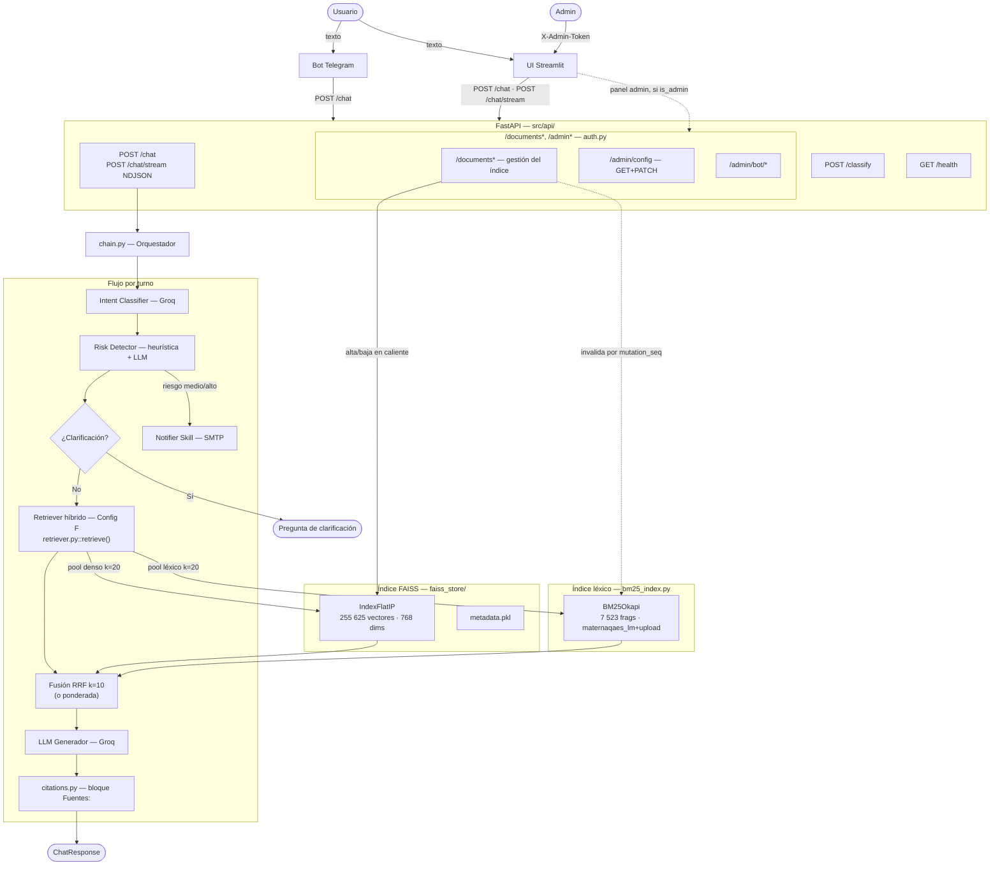

<style>
  img { max-width: 100%; height: auto; display: block; margin: 10px auto; border: 1px solid #DDDDDD; border-radius: 4px; }
</style>

# Maternas — Informe Técnico de Desarrollo

<p align="center"></p>

### Chatbot RAG para Información y Orientación en Salud Materna

> **Informe técnico del sistema**
> Convocatoria **890 de Minciencias** · Institución Universitaria de Envigado

---

### Equipo de desarrollo

* **Juan Pablo Ríos Ortiz** — `jprioso@correo.iue.edu.co`
* **Daniel Restrepo Villa** — `drestrepov@correo.iue.edu.co`
* **Cristian Troncoso Guerra** — `ctroncosog@correo.iue.edu.co`

## 📌 Información del proyecto

| Campo                    | Detalle                                 |
| ------------------------ | --------------------------------------- |
| **Proyecto**             | Agente inteligente basado en procesamiento de lenguaje natural para seguimiento materno en época pospandémica para un entorno de Telemedicina |
| **Código del proyecto**    | COD_00-215                              |
| **Institución**          | Institución Universitaria de Envigado   |
| **Versión evaluada**     | `2b1e4c6` · rama `master` (Config F — retrieval híbrido, commiteado y pusheado a `origin/master`) |
| **LLM Generador**        | `openai/gpt-oss-120b` (Groq) — migrado desde `llama-3.3-70b-versatile`, dado de baja por Groq el 16/08/2026 |
| **Índice en producción** | Configuración F (híbrido denso+BM25, fusión RRF) |
| **Vectores indexados**   | 255.625 (tras la re-ingesta de `maternaqaes_lm` con `--min-clinical-score 8`, sección 8) |
| **Fecha del informe**    | 30 de agosto de 2026 (revisión de arquitectura y evaluación — la evidencia en vivo de la sección 6.3–6.9 sigue siendo la del 19 de agosto; ver nota en la sección 6 y la nueva evaluación en la sección 8) |

---

## 1. Resumen ejecutivo

**Maternas** es un chatbot conversacional basado en Recuperación Aumentada por Generación (RAG) orientado a madres gestantes y en período postparto, que responde consultas de salud materna en español —control prenatal, signos de alarma, medicamentos, nutrición, lactancia y salud mental perinatal— clasificando primero la intención y el riesgo clínico de cada mensaje antes de generar una respuesta fundamentada en literatura médica indexada. El sistema opera con costo marginal cercano a cero (APIs gratuitas de Groq/Cerebras, embedding local) sobre hardware de gama media, sin fine-tuning de modelos generadores (ver sección 9.2). A la fecha de este informe el desarrollo está en estado **funcional y probado en vivo**: expone tres interfaces (API FastAPI, UI Streamlit con panel de administración, bot de Telegram), un índice FAISS de 255.625 vectores en producción con retrieval híbrido denso+BM25 (Config F), una suite de 6 configuraciones de retrieval evaluadas experimentalmente con Ragas y con un harness determinista propio, y una batería de pruebas automatizadas (`pytest`, 307/307). El LLM generador se migró de `llama-3.3-70b-versatile` a `openai/gpt-oss-120b` tras la baja del primero por parte de Groq (16/08/2026); las secciones 6 y 8 reportan el sistema ya migrado y revalidado, primero sobre Config D (evaluación en vivo del 19/08) y luego sobre Config F, la arquitectura híbrida descrita en la sección 3 (evaluación del 28/08, sección 8). Frente a Config D, las **5 métricas Ragas mejoran simultáneamente** en Config F: `faithfulness` 0,392→0,617, `answer_correctness` 0,636→0,788, `answer_relevancy` 0,810→0,940 (máximo histórico de la serie, sobre baseline 0,558), `context_recall` 0,422→0,637 y `context_precision` 0,336→0,561. `faithfulness` sigue por debajo del baseline publicado (0,713); esa brecha responde a un problema de generación, no de retrieval — el LLM no siempre se ancla literalmente en el contexto recuperado, aun cuando ese contexto ya es más completo y preciso (ver sección 9.5). Tras la evaluación en vivo del 19/08/2026 el desarrollo continuó con varias entregas adicionales: operación responsable (secciones 6.10–6.12 — uso en tiempo real anonimizado, notificador de riesgo sin repetición y con secuencia completa, segunda capa de Términos y Condiciones) y, más recientemente, la reincorporación de BM25 fusionado con el retrieval denso y la eliminación de un techo estructural de recall en la ingesta (secciones 3 y 8), documentadas en esta revisión del informe.

---

## 2. Contexto y objetivos

### Problema que resuelve

En contextos de bajos recursos, las gestantes frecuentemente no tienen acceso rápido a orientación médica ante dudas cotidianas o síntomas de alarma. Maternas actúa como primer filtro informativo: clasifica la urgencia clínica de cada consulta y, cuando detecta riesgo medio o alto, escala mediante una notificación automática por correo electrónico, además de indicar siempre al usuario que busque atención profesional.

### Alcance funcional

- Conversación en lenguaje natural sobre síntomas del embarazo, control prenatal, medicamentos, nutrición, lactancia, postparto y salud mental perinatal.
- Clasificación automática de intención (12 categorías) y de riesgo clínico (bajo/medio/alto, en cascada heurística → LLM).
- Recuperación de fragmentos de literatura médica (FAISS) y generación de respuestas con citas a la fuente.
- Escalamiento por correo electrónico ante riesgo medio/alto.
- Panel de administración para gestión del índice, configuración en caliente y monitoreo.

### Usuarios objetivo

Gestantes y su red de apoyo (pareja, familiares) — el sistema está diseñado explícitamente para que terceros puedan consultar en representación o junto a la gestante (sin restricción de autoría en el prompt ni en la UI; no se incluye un caso de prueba específico de este escenario en la sección 6 de esta versión del informe).

### Restricciones del proyecto

Según `foragents/project_constraints.md`: sin QLoRA ni fine-tuning en esta fase, priorizando simplicidad, rapidez de implementación y costo cercano a cero, sobre hardware disponible (AMD Ryzen 5, RTX 2050, 16 GB RAM).

---

## 3. Arquitectura de la solución

### Diagrama de alto nivel



### Componentes principales

| Componente | Responsabilidad |
|---|---|
| **Bot Telegram** | Cliente ligero: reenvía a `POST /chat`, historial en RAM, scheduler de check-ins |
| **UI Streamlit** | Chat público + panel admin (Dashboard/Documentos/Métricas/Configuración/Consola) |
| **FastAPI** | Valida requests, carga FAISS en `lifespan`, expone endpoints públicos y administrativos |
| **chain.py** | Orquestador del turno: intent → risk → clarificación → notificación → retrieval → generación → citas |
| **Intent Classifier** | 12 categorías, zero-shot vía Groq, con fallback heurístico |
| **Risk Detector** | 3 niveles, heurística instantánea + LLM de confirmación, consciente del historial de la conversación |
| **Retriever (Config F)** | Híbrido: FAISS denso (`medmcqa`+`medqa_*`+`maternaqaes_lm`+`upload`) fusionado por RRF con BM25 léxico (`maternaqaes_lm`+`upload`) |
| **Notifier Skill** | Alerta SMTP ante riesgo medio/alto |

### Arquitecturas evaluadas

El retriever pasó por seis configuraciones sucesivas, cada una medida con el mismo protocolo de evaluación Ragas (y, desde Config F, también con un harness determinista propio) antes de decidir el cambio (detalle completo en `foragents/retrieval_arquitecturas_configs.md` y `foragents/qa_technical.md`):

| Config | Descripción | Resultado de la decisión |
|---|---|---|
| **A** — FAISS puro | Búsqueda densa sobre todo el índice sin distinción de fuente | Descartada: casos clínicos de Multiclinsum contaminaban el contexto |
| **B** — FAISS + BM25 | Capa densa filtrada por fuente + BM25 léxico solo para Multiclinsum | Mejoró `faithfulness` (+41%) y latencia (−9%) vs A |
| **C** — + corpus obstétrico ES | Se añadió `maternaqaes_lm` (corpus colombiano) | Salto grande en `context_recall` (0.067→0.452) y `faithfulness` (+27%) |
| **D** — sin `textbook`/`multiclinsum` | Se removieron 127.290 vectores (33,4% del índice) por riesgo de licencia no resuelto (18 textbooks EN sin licencia de reuso identificable, MultiClinSum sin garantía de desidentificación documentada) | Medido primero contra C antes de ejecutar: deltas dentro del ruido estadístico (±0.25 std, N=14) — sin pérdida medible de calidad. `bm25_index.py` se eliminó por quedar sin corpus que indexar |
| **E** — Config D + HyDE | Genera un párrafo hipotético vía LLM antes de embeder la query | **Descartada.** Ninguna métrica mejoró de forma concluyente (deltas dentro del ruido); costo real: +1,27 s de latencia por turno y agotamiento de cuota diaria de Groq a mitad de la corrida de evaluación |
| **F** — Config D + BM25 híbrido + techo de recall corregido *(producción actual)* | BM25 reincorporado, esta vez sobre `maternaqaes_lm`+`upload` (no Multiclinsum), fusionado con el denso vía RRF; `MIN_CLINICAL_SCORE` de la ingesta bajado de 15 a 8 (2.156 chunks nuevos, alcanzabilidad del golden set 72,6%→100%) | Adoptada: las 5 métricas Ragas mejoran a la vez frente a D (sección 8); confirmado primero con el harness determinista (Recall@5 0,838→0,915) antes de gastar cuota de Ragas |

La decisión de remover `textbook`/`multiclinsum` (Config D), de no adoptar HyDE (Config E) y de adoptar el híbrido con umbral de ingesta corregido (Config F) ilustra el patrón de trabajo del equipo: cada cambio de arquitectura se midió con Ragas sobre el mismo conjunto de pares *antes* de aplicarse en producción, en vez de decidirse a priori. Para Config F específicamente, el ajuste de hiperparámetros de fusión y del umbral de ingesta se hizo primero contra un harness determinista sin juez LLM (`src/evaluation/retrieval_eval.py`) — con 15-20 pares y un juez LLM, Ragas no distingue una mejora de Recall@5 de unos pocos puntos del ruido de evaluación (~0,25 std); Ragas se reservó para la medición oficial, una sola vez, sobre la configuración ya elegida.

---

## 4. Stack tecnológico

| Capa | Tecnología | Versión |
|---|---|---|
| Lenguaje | Python | 3.12.7 |
| API backend | FastAPI + uvicorn | 0.115.6 / 0.32.1 |
| Interfaz web | Streamlit | 1.41.1 |
| Bot de mensajería | python-telegram-bot | 21.10 |
| LLM generador | `openai/gpt-oss-120b` (Groq API) | — |
| LLM evaluador (judge) | `gemma-4-31b` (Cerebras API) | — |
| Embedding | `intfloat/multilingual-e5-base` (768 dims, ES/EN/ZH) | — |
| Vector store | FAISS `IndexFlatIP` | 1.9.0 |
| Retrieval léxico complementario | BM25 (`rank-bm25`) | 0.2.2 |
| Orquestación LLM | LangChain (text splitters) | 0.3.13 |
| Evaluación | Ragas | 0.2.12 |
| Validación de configuración | Pydantic Settings | 2.14.1 |
| Cifrado de datos en reposo | `cryptography` (Fernet) | — |

Datasets indexados: **MedMCQA** (187.005 preguntas médicas EN, Apache 2.0), **MedQA** (USMLE/Taiwan/Mainland, MIT) y **MaternaQA-es LM** (7.509 sub-chunks tras la re-ingesta con `--min-clinical-score 8`, más 14 documentos subidos vía panel — 7.523 en total indexados por BM25 —, corpus obstétrico colombiano, único dataset en español específico del dominio).

---

## 5. Setup

Pasos verificados para levantar el sistema en local (`README.md` y `docs/DOCUMENTACION.md` §14).

### Instalación

```bash
# 1. Clonar el repositorio
git clone https://github.com/elrios893/maternas-rag.git
cd maternas-rag

# 2. Crear entorno virtual
python -m venv venv
.\venv\Scripts\activate        # Windows
# source venv/bin/activate     # Linux/macOS

# 3. Instalar PyTorch con soporte CUDA (si hay GPU NVIDIA — recomendado para ingesta)
pip install torch==2.5.1+cu121 --index-url https://download.pytorch.org/whl/cu121

# 4. Instalar el resto de dependencias
# (requirements.txt pinea sentence-transformers==2.7.0 — la versión 3.3.1
# producía un cuelgue silencioso al importar junto con torch)
pip install -r requirements.txt

# 5. Configurar variables de entorno
cp .env.example .env
# Editar .env con GROQ_API_KEY y demás valores requeridos
```

### Arrancar el sistema

```bash
# Terminal 1 — API FastAPI
python -m uvicorn src.api.main:app --port 8080 --reload

# Terminal 2 — UI Streamlit
streamlit run src/ui/app.py

# Terminal 3 — Bot Telegram (opcional, requiere la API corriendo)
python src/bot/maternas_bot.py
```

- UI Streamlit: `http://localhost:8501`
- API docs (Swagger): `http://localhost:8080/docs`

### Ingesta del índice FAISS (one-time, ~5h con GPU — no se ejecuta en este informe, ver sección 6.1)

```bash
python src/ingestion/run_ingestion.py
# o por dataset individual:
python -m src.ingestion.ingest_medmcqa
python -m src.ingestion.ingest_medqa
python -m src.ingestion.ingest_maternaqaes_lm
```

### Tests

```bash
./venv/Scripts/python.exe -m pytest -q
```

Suite en `tests/` (clasificadores, gestión de documentos, config editable, supervisor del bot, citas, chat streaming, usuarios activos). Los fixtures de `tests/conftest.py` evitan cargar el índice FAISS real (~780 MB) y resetean los singletons de clientes Groq cacheados entre tests.

---

## 6. Pruebas y resultados

> Cada subproceso sigue el formato *narrativa corta → evidencia visual → observación técnica*. Las secciones 6.1 y 6.2 (ingestión, indexación) se documentan con el código real, sin ejecución en vivo (no dependen del LLM generador y no cambiaron con la migración). Las secciones 6.3 en adelante corresponden a la evaluación en vivo del **19 de agosto de 2026**, ya con `openai/gpt-oss-120b` como LLM de producción, contra la API (`localhost:8080`), la UI Streamlit (`localhost:8501`) y el bot de Telegram real (`@MaternasAssistant_bot`), con el índice FAISS de producción (253.455 vectores) cargado. Para cada caso de prueba se abrió una sesión nueva (pestaña nueva de Streamlit, o `/reset` en Telegram), de modo que el aviso de tratamiento de datos y el estado de riesgo partieran limpios en cada uno. Las secciones 6.10–6.13 son nuevas en esta revisión (25/08/2026): documentan tres entregas posteriores a esa evaluación en vivo (uso en tiempo real, deduplicación del notificador de riesgo, segunda capa de Términos y Condiciones) con el mismo criterio que 6.1–6.2 — código real más la suite `pytest`.

### 6.1 Ingestión

La ingestión puebla el índice FAISS a partir de los datasets crudos y **no se ejecuta en vivo** para este informe: reconstruir o alterar el índice de producción toma horas (~5h con GPU) y puede dejarlo en un estado inconsistente. Se documenta con el código real y los registros de ejecuciones anteriores.

`src/ingestion/run_ingestion.py` orquesta tres scripts idempotentes (Multiclinsum, MedMCQA, MedQA) que pueden relanzarse desde el último checkpoint si el proceso se interrumpe. Cada dataset pasa por `formatters.py` (7 formateadores, uno por fuente) y luego por `chunkers.py`, que decide la estrategia de chunking según `source_dataset`:


*Captura del código real de `run_ingestion.py`: ejecuta los tres scripts de ingesta en orden y reporta el cierre del proceso.*


*`chunk_document()` decide entre passthrough (MedMCQA/MedQA, sin chunking), agrupación por párrafos (~350 tok, Multiclinsum fulltext) o `RecursiveCharacterTextSplitter` (400 tok / 80 overlap, textbooks/uploads), según `source_dataset`.*

**Observación técnica:** el tamaño de chunk no es un parámetro arbitrario — la sección 8 de este informe muestra que re-chunkar `maternaqaes_lm` de ~879 a ~336 tokens promedio subió `faithfulness` un 170% (0,133→0,359), por lo que `CHUNK_SIZE_TOKENS=400` en `chunkers.py` refleja una decisión validada empíricamente, no un valor por defecto.

### 6.2 Indexación

Tampoco se ejecuta en vivo, por la misma razón que la ingestión. Se documenta con el código de `FAISSStore` y `embedder.py`.


*`is_active()` — un fragmento participa en el RAG salvo que esté explícitamente desactivado; el docstring documenta por qué nunca se usa `meta["active"]` sin valor por defecto (descartaría el 100% del índice existente en silencio, ver también sección 9).*


*`embed_documents()` antepone `"passage: "` y `embed_query()` antepone `"query: "` — requisito del modelo `multilingual-e5-base`; sin estos prefijos los scores de similitud bajan ~15% (`qa_technical.md` Q5).*

**Observación técnica:** `FAISSStore` usa `IndexFlatIP` (búsqueda exacta, sin aproximación) en vez de `IndexIVFFlat`. Con ~253k–380k vectores la búsqueda exacta resuelve en 20–50ms; la aproximación de IVFFlat solo se justifica a partir de millones de vectores (ver decisión en sección 9).

### 6.3 Retrieval

Ejecutado en vivo contra el índice de producción a través de la UI Streamlit, ya con `openai/gpt-oss-120b` como LLM activo, en tres sesiones nuevas independientes: una gestante consultando directamente y continuando la conversación hacia un síntoma de riesgo medio, un flujo de clarificación completo, y un caso de riesgo alto directo.

**Sesión nueva — aviso de tratamiento de datos:**


*Cada sesión nueva de navegador (una pestaña nueva basta) abre este `st.dialog` antes de habilitar el chat. Sin aceptar, el campo de mensaje permanece deshabilitado ("Acepta el aviso de datos para poder escribirme").*

**Caso 1 — Gestante, consulta directa: pregunta informativa que continúa hacia riesgo medio:**


*Consulta real: "Tengo hinchazón leve en los pies, estoy en la semana 30, ¿es normal?" — clasificada `riesgo=low`, respuesta cálida y natural en español, con cita `[1]` y sin ningún rastro de `<think>` (el hallazgo que motivó blindar `reasoning_format` en el código, sección 9.1).*


*Mismo hilo, segundo turno: "Ahora también tengo fiebre de 37.8 desde ayer, ¿debería preocuparme?" El panel lateral muestra en vivo: intención `Signos de alarma`, riesgo `Medio`, acción `medical_consultation`, señal `fiebre_moderada` — el sistema combina este mensaje con la hinchazón del turno anterior de la misma sesión.*

**Caso 2 — Flujo de clarificación, con notificación disparada después de la clarificación (sesión nueva):**


*Consulta real, deliberadamente vaga: "Puedo tomar algo?" (3 tokens, sin keyword de medicamento reconocida). El sistema no genera una respuesta médica a ciegas: pide contexto ("¿Podrías contarme qué te está molestando y en cuántas semanas de embarazo te encuentras?").*


*Respuesta del usuario a la clarificación: "Tengo fiebre leve desde anoche y estoy en la semana 22." El sistema combina ambos turnos ("Puedo tomar algo" + fiebre/semana 22), clasifica `riesgo=Medio` (señal `fiebre_moderada`) y responde mencionando explícitamente la semana 22 — la pregunta original vaga por sí sola no traía esa información.*

**Caso 3 — Riesgo alto directo (capa heurística, sin pasar por el LLM de riesgo; sesión nueva):**


*Consulta real: "Estoy sangrando mucho y tengo dolor abdominal muy fuerte, ¿qué hago?" El panel lateral muestra `riesgo=ALTO`, acción `urgent_care`, señal `hemorragia` (detectada por la capa heurística de `risk_detector.py`, sin consultar al LLM); la respuesta generada por `gpt-oss-120b` sí pasa por el modelo, con el sufijo urgente del prompt (`URGENT_SUFFIX`) y sin fugas de razonamiento.*

**Observación técnica:** las capturas de esta sección (19/08/2026) corresponden a Config D (retriever denso puro, sin BM25); esa arquitectura pedía k×10 candidatos internos y filtraba a `k=5` finales sobre `medmcqa`+`medqa_*`+`maternaqaes_lm`. Los scores observados en vivo (0,83–0,86) fueron consistentes con los reportados en `qa_technical.md` para el mismo tipo de consulta.

**Verificación de Config F (28/08/2026, invocación directa de `chat()`):** con el retriever híbrido ya en producción, se ejecutaron 5 consultas representativas para confirmar que la fusión aparece en las fuentes devueltas. Ejemplo con desempate léxico visible: *"¿Qué es la vaginosis bacteriana recurrente?"* devolvió 5 fuentes de `maternaqaes_lm` — 4 con `retrieval=hybrid` y 1 con `retrieval=bm25` — con una respuesta correctamente citada (`[1] vol831-1 · págs. 24, 26`). Otro caso, *"Estoy en la semana 32 y tengo sangrado vaginal abundante, ¿qué hago?"*, devolvió una mezcla de `hybrid`, `dense` y `bm25` en la misma llamada, confirmando que las tres etiquetas de `src/rag/retriever.py::retrieve()` conviven en el flujo real. Esta verificación queda documentada por el output textual del script y por la corrida oficial de Ragas (sección 8).

### 6.4 Clasificación de intención

Evidencia visible en las capturas de la sección 6.3 (`intent_classifier.py` clasifica en el mismo turno que el retrieval). En el Caso 1 la intención pasó de `sintomas_embarazo` (hinchazón) a `signos_de_alarma` (fiebre) al combinarse con el historial; en el Caso 2 la intención se mantuvo en `medicamentos` en la pregunta vaga inicial, y en el Caso 3 se clasificó directamente `signos_de_alarma`.

**Observación técnica:** `intent_classifier.py` expone 12 categorías fijas con tres niveles de fallback (zero-shot LLM → heurística por keywords → categoría por defecto), garantizando que el sistema siempre devuelva un intent válido incluso sin conexión a Groq.

### 6.5 Clasificación de riesgo

Misma evidencia visual (sección 6.3). El hallazgo relevante de la prueba en vivo: `detect_risk()` (`src/classifiers/risk_detector.py`) combina explícitamente los síntomas mencionados en turnos previos de la conversación con el mensaje actual antes de aplicar la heurística, para no evaluar cada síntoma aislado del cuadro clínico completo. Esto se observó en el Caso 1 (la fiebre se evaluó como continuación del turno de hinchazón) y en el Caso 2 (la clarificación combinó "Puedo tomar algo" con la fiebre y la semana de gestación de la respuesta) — comportamiento clínicamente conservador e intencional, verificado que ocurre en el backend y no en la UI (`chat_view.py` solo lee `meta[-1]`, el último turno).

### 6.6 Redacción

La generación de respuesta y el armado de citas (`citations.py`) se observan en todas las capturas anteriores: el LLM inserta marcadores `[n]` dentro del texto y `build_reference_block()` arma el bloque final `Fuentes:` agrupando por documento con nombre legible y páginas, no "fragmento [n]" genérico (ver Caso 1, sección 6.3). El `reasoning_format:"hidden"` (sección 9.1) evita que el razonamiento del modelo se filtre a este texto.

### 6.7 Notificador de riesgo (SMTP)

Cada vez que `risk_detector.py` devuelve nivel `medium` o `high`, `NotifierSkill` dispara un correo de alerta real. Se verificó end-to-end contra la bandeja de entrada real (`maternasrag@gmail.com`), incluyendo el caso específico de una notificación disparada **después** de un intercambio de clarificación (Caso 2, sección 6.3) — la ruta con mayor riesgo de la migración, ya que la decisión de notificar pasa por el mismo LLM que ahora razona antes de responder (sección 9.1).


*Correo real recibido en `maternasrag@gmail.com` para el Caso 1 de la sección 6.3, con el mensaje de fiebre citado textualmente y el razonamiento generado por el LLM.*


*Correo real correspondiente al Caso 2: el "Mensaje del usuario" que se cita es la respuesta a la clarificación ("Tengo fiebre leve desde anoche y estoy en la semana 22") — confirmando que la notificación se disparó una vez el sistema tuvo el cuadro completo, no con la pregunta vaga inicial.*


*Correo real correspondiente al Caso 3 (hemorragia): riesgo `HIGH`, señal `hemorragia`, notificación disparada de forma incondicional (todo riesgo alto notifica siempre, sin pasar por la decisión del LLM).*

**Observación técnica:** los tres correos llegaron en menos de un minuto desde el envío del mensaje en cada caso, confirmando que la decisión de notificación (`_run_notification()`, con `max_tokens` subido de 10 a 512 tras la migración — sección 9.1) sigue funcionando de forma confiable con el modelo de razonamiento.

### 6.8 Streamlit

Ver captura de consentimiento en la sección 6.3. La respuesta se transmite token a token vía `POST /chat/stream` (NDJSON: `status`→`meta`→`delta`*→`done`), visible en vivo como los mensajes de progreso "Analizando tu mensaje…" → "Buscando en la base de conocimiento médico…" → "Redactando la respuesta…" antes de que el texto final aparezca, según `STAGE_LABELS` en `chat_view.py`. Con `gpt-oss-120b` el streaming se probó explícitamente en el Caso 3 de la clasificación de riesgo (ver smoke test, sección 9.1): los eventos `delta` llegan limpios, sin bloques `<think>` intercalados.

### 6.9 Telegram

Bot real (`@MaternasAssistant_bot`) probado en vivo vía Telegram Web, con la API de producción corriendo en `localhost:8080` y el bot administrado como subproceso desde el panel admin (sección 7.6).


*Enviando `/reset` se reinicia la conversación y el aviso de tratamiento de datos se muestra de nuevo antes de procesar cualquier mensaje — mismo comportamiento que Streamlit, pero como botones inline (`✅ Acepto` / `❌ No acepto`) en vez de un `st.dialog`.*


*Consulta real: "Es normal tener nauseas a las 10 semanas?" — clasificada `risk=low`, respuesta cálida en texto plano con bloque `Fuentes:`, sin fugas de `<think>` en el canal de Telegram.*

**Observación técnica (hallazgo operativo, no atribuible al cambio de modelo):** durante esta sesión de pruebas el subproceso del bot se detuvo solo (`proceso terminado, code=1`, visible en los logs de la Consola admin) después de ~33 minutos corriendo, sin traza de excepción capturada en los últimos 200 renglones de log expuestos por el panel. Se reinició sin incidentes desde el botón "Iniciar" (sección 7.6) y continuó funcionando con normalidad. No se investigó la causa raíz a la fecha de este informe — se documenta como observación, no como parte del alcance de la migración de modelo, y queda como item de seguimiento.

### 6.10 Uso en tiempo real, anonimizado (`src/api/usage_sessions.py`)

Subsección nueva del panel de Métricas (ver también 7.4): cuenta cuántas sesiones están activas ahora mismo en Streamlit y en Telegram, cada una con su duración y sus tokens consumidos, **sin ninguna forma de diferenciar una sesión de otra** entre dos lecturas del panel.

`touch(session_id, platform, tokens_used)` se llama en cada turno de `POST /chat` y acumula tokens contra un registro en memoria, sin persistencia. `session_id` lo genera el cliente (`uuid4` aleatorio) — Streamlit lo crea una vez por sesión de navegador (`app.py`), Telegram uno por `chat_id` de conversación pero nunca lo expone; ninguno de los dos se deriva de un identificador real. `active_by_platform()` descarta las sesiones sin actividad hace más de `IDLE_TIMEOUT_SECONDS` (15 min), agrupa por plataforma, ordena por duración descendente y devuelve únicamente `{active_seconds, tokens_total}` por fila — el `session_id` nunca sale de `usage_sessions.py`, ni siquiera hacia `GET /admin/usage_sessions`. `metrics_view.py::_render_usage_platform()` renderiza esas filas en una tabla sin columna de índice estable, para que tampoco se pueda inferir "la fila 2 de hace un minuto es la fila 1 de ahora".

**Observación técnica:** el mismo patrón (`session_id` aleatorio, registro en memoria, poda por inactividad de 15 min) se reutilizó para la deduplicación de notificaciones de riesgo de la sección 6.11 — ambos módulos comparten la noción de "sesión activa" pero se definen por separado (`usage_sessions.py` en `src/api/`, `risk_episodes.py` en `src/rag/`) para no romper la regla de capas del proyecto: `src/rag/` no puede importar de `src/api/`.

### 6.11 Notificador de riesgo: secuencia completa en el correo y fin de la "contaminación" entre turnos

Dos problemas encontrados tras la migración a `gpt-oss-120b` (sección 9.1), corregidos juntos porque comparten la misma causa raíz — el riesgo se venía evaluando turno a turno sin memoria de qué ya se había notificado:

1. **El correo solo mostraba el mensaje que disparó la alerta**, sin el resto de la conversación que le dio contexto clínico. `chain.py` ahora arma la secuencia completa (`history` + mensaje actual, capada a `NOTIFICATION_HISTORY_CAP=20` turnos) y se la pasa a `notify_risk(..., conversation=[...])`. `_build_email_body()` (`src/skills/notifier/tool.py`) imprime cada turno con su rol (`[Paciente]`/`[Asistente]`) y marca el último con `<<< MENSAJE QUE DISPARO LA ALERTA`, para que quede claro cuál de todos gatilló el correo sin perder el resto del cuadro.
2. **Turnos posteriores, ya sin relación con el riesgo detectado, seguían disparando el mismo correo** — el riesgo "medio" de un turno viejo contaminaba la clasificación de mensajes nuevos no relacionados. La solución tiene dos mitades independientes: `risk_detector.py` deja de combinar incondicionalmente el mensaje actual con todo el historial (solo lo hace si el nuevo mensaje sigue siendo parte del mismo cuadro; si no, evalúa el mensaje aislado); y `src/rag/risk_episodes.py` (nuevo) guarda, por `session_id`, únicamente la última señal *efectivamente notificada* (nivel + categorías de banderas — nunca texto del mensaje), para decidir si un turno nuevo es la misma alerta ya enviada o un riesgo distinto que sí amerita un correo nuevo.

`risk_episodes.py` expone una API de dos fases a propósito: `is_new_signal()` (solo lectura, decide si vale la pena seguir evaluando) y `commit()` (se llama únicamente cuando el correo se envió de verdad). Un riesgo "medio" pasa por una decisión adicional del LLM antes de confirmarse — si `commit()` se llamara antes de esa decisión, un medio que el LLM termina descartando quedaría registrado como si sí se hubiera avisado, y una repetición real de ese mismo riesgo después se suprimiría sin que nunca se hubiera mandado el primer correo. Un turno "low" cierra el episodio de inmediato (`register_low()`): la siguiente alerta medium/high se trata siempre como nueva, sin importar qué banderas comparta con la anterior.

**Validación:** suite dedicada (`tests/test_risk_episodes.py`, `tests/test_chain_notification.py`, `tests/test_notifier.py`, más casos añadidos a `tests/test_risk_detector.py`) y verificación en vivo durante el desarrollo contra el flujo real (API + SMTP real a `maternasrag@gmail.com`): un turno de riesgo medio dispara un correo con la secuencia completa; un turno siguiente sin relación clínica (p. ej. "gracias") deja de disparar un segundo correo; un turno con un riesgo nuevo y distinto sí dispara uno nuevo. Queda cubierta además por la suite automatizada (sección 6.13).

### 6.12 Segunda capa de aceptación: Términos y Condiciones (`src/consent.py`, `src/ui/consent_gate.py`)

Tras el aviso de tratamiento de datos (ya existente, sección 6.3) se añadió una segunda pantalla obligatoria y secuencial: Términos y Condiciones de uso. Ambas capas viven en `src/consent.py`, compartido entre Streamlit y el bot de Telegram, y ambas deben quedar en `"accepted"` antes de habilitar cualquier página o comando — rechazar cualquiera de las dos termina la sesión y la próxima vez que el usuario escribe se le vuelve a mostrar la capa 1 desde cero, nunca a mitad de camino.

En Streamlit, `consent_gate.py::enforce_consent()` corre antes de `st.navigation()` y detiene el script con `st.stop()` mientras falte cualquiera de las dos aceptaciones — a diferencia de la versión anterior (que solo bloqueaba el formulario de envío), así ninguna página del panel (Documentos, Métricas, Configuración, Consola) queda alcanzable detrás del modal. En Telegram, `maternas_bot.py` replica el mismo estado de dos capas (`consent_status`, `terms_status`) con botones inline (`✅ Acepto` / `❌ No acepto`) y un `terms_callback()` independiente del de consentimiento de datos.

El texto de `TERMS_TEXT` se marca explícitamente como **"BORRADOR — PENDIENTE DE REVISIÓN LEGAL"** (texto completo en el anexo 11.4): cubre naturaleza del servicio (prototipo de investigación, no un dispositivo médico), ausencia de garantías, límite de responsabilidad, uso aceptable, propiedad del contenido generado y posibilidad de cambios mientras el proyecto esté en fase experimental. Es una especificación funcional razonable, consistente con el resto del proyecto, no un documento legal definitivo — el propio README (sección "Advertencia de uso y puesta en producción") ya exige su revisión y aprobación por las instancias jurídicas y éticas del proyecto antes de cualquier uso productivo.

**Observación técnica:** el flujo se verificó visualmente durante el desarrollo de la funcionalidad, antes del commit `754ef4a`. El comportamiento de los dos gates (Streamlit y Telegram) está cubierto además por la suite automatizada (sección 6.13).

### 6.13 Verificación de regresión (suite automatizada)

Suite completa (`pytest`) en verde al commit `2b1e4c6`: **307 passed, 0 failed** (307/307, sobre el retrieval híbrido de Config F descrito en la sección 9.4 — frente a 280/280 al commit `754ef4a` y 241/241 al momento de la migración de LLM, sección 9.1; el crecimiento reciente corresponde a `tests/test_bm25_index.py` y `tests/test_retriever_fusion.py`, 27 tests nuevos). Confirma que ni las entregas de operación responsable ni el retrieval híbrido rompieron comportamiento previamente probado (clasificadores, gestión de documentos, config editable, supervisor del bot, citas, chat streaming).

---

## 7. Panel de administración

Probado en vivo, con `ADMIN_API_TOKEN` real. El panel vive dentro de la misma app de Streamlit y solo aparece si la sesión se autenticó como admin.

### 7.1 Acceso


*Campo "Token de administración" en la barra lateral, con el token real ya ingresado (enmascarado) — sin token correcto, el panel permanece inalcanzable.*


*Tras pulsar "Entrar", la navegación lateral revela cinco páginas nuevas: Dashboard, Documentos, Métricas, Configuración y Consola.*

### 7.2 Dashboard


*Resumen de sesión y estado del sistema: API conectada, 253.455 fragmentos, modelo de embedding activo y contador de mensajes de la sesión actual.*

### 7.3 Documentos


*Vista agregada real del índice: 248.161 documentos, 253.455 fragmentos, ~138 MB de texto indexado. Permite buscar, ver detalle paginado, activar/desactivar y subir documentos nuevos — sin cambios respecto a la migración de modelo, el índice de retrieval es independiente del LLM generador.*

### 7.4 Métricas


*Lectura en vivo de la corrida generada para este informe (`configD_oss120b — 20260819_113326`) sin recomputar nada — coincide exactamente con la tabla de la sección 8 y con `evaluation_reports/eval_report_configD_oss120b_20260819_113326.md`. Esta captura es previa a la subsección "Uso en tiempo real" (sección 6.10), añadida arriba de esta tabla en la misma página tras el 19/08/2026 — sin captura propia en esta revisión.*

### 7.5 Configuración


*Confirma en vivo la configuración activa: embedding `multilingual-e5-base` en `cuda`, **LLM `openai/gpt-oss-120b`**, y las fuentes activas del índice denso (`maternaqaes_lm`, `medmcqa`, `medqa_mainland`, `medqa_taiwan`, `medqa_us`, `upload`) — Config D, sin `textbook` ni `multiclinsum`. Esta captura es la confirmación en vivo de que la migración de la sección 9.1 quedó efectivamente desplegada, no solo cambiada en código.*

### 7.6 Consola — API y bot de Telegram


*Estado inicial de la sesión de pruebas: API corriendo, bot de Telegram detenido — se inició deliberadamente desde este panel (en vez de manualmente) para poder demostrar el ciclo completo Iniciar/logs con el `.env` de este informe.*


*Tras pulsar "Iniciar", la API lo lanza como subproceso hijo (`PID 21928` en la captura) — este es el segundo arranque de la sesión: el primero (`PID 19524`) se detuvo solo tras ~33 minutos (ver observación en la sección 6.9) y se reinició sin incidentes desde este mismo botón.*

**Observación técnica:** el estado del bot que reporta este panel es el que administra `bot_supervisor.py` (`subprocess.Popen`), no cualquier proceso de `maternas_bot.py` corriendo en la máquina — un bot iniciado manualmente por fuera de la API aparece como "Detenido" en este panel hasta que se administra a través de él, consistente con el diseño de estado por-proceso documentado en la sección 9.3.

---

## 8. Resultados y evaluación

Framework: **Ragas**, benchmark **MaternaQA-es** (split test, 328 pares QA en español), evaluación en dos fases con modelos independientes (Groq `openai/gpt-oss-120b` genera, Cerebras `gemma-4-31b` evalúa) para evitar que el mismo modelo se autoevalúe.

> **Nota de migración:** esta corrida reemplaza a la del 15/08/2026 (ver `informe-tecnico-maternas-20260815.md`), medida con `llama-3.3-70b-versatile` (N=14). Groq dio de baja ese modelo el 16/08/2026; `openai/gpt-oss-120b` es su reemplazo oficial. Mismo protocolo, mismo seed=42 y mismo tamaño de muestra pedido (15 pares; la corrida anterior tuvo 1 par excluido en fase de evaluación, esta tuvo 0), para que el delta sea atribuible principalmente al cambio de generador.

### 8.1 Métricas de producción actual (Config F)

| Métrica | Config F (producción) | Baseline MaternaQA-es (test) | Estado |
|---|---:|:---:|:---:|
| `faithfulness` | 0,617 | 0,713 | 🟡 |
| `answer_correctness` | 0,788 | N/A | 🟢 |
| `answer_relevancy` | **0,940** | 0,558 | 🟢 (supera baseline, máximo histórico) |
| `context_recall` | 0,637 | N/A | 🟢 |
| `context_precision` | 0,561 | N/A | 🟡 |
| `latency_avg_s` | ~16,1 s | — | — |

*N = 39 pares evaluados. Generador `openai/gpt-oss-120b` (Groq), juez `gemma-4-31b` (Cerebras). Fuente: `evaluation_reports/eval_report_configF_20260828_173548.md`.*

### 8.2 Validación del retrieval con harness determinista (previo a Ragas)

Siguiendo el patrón del proyecto de no gastar cuota de Ragas sobre hipótesis no verificadas, la fusión híbrida y el nuevo umbral de ingesta se midieron primero con `src/evaluation/retrieval_eval.py` (sin juez LLM, acierto exacto por `chunk_id`) sobre los 328 pares completos del golden set:

| Estrategia | R@5 | R@10 | MRR@10 |
|---|---:|---:|---:|
| Denso (Config D) | 0,838 | 0,902 | 0,647 |
| BM25 solo | 0,860 | 0,930 | 0,717 |
| **Híbrido RRF (Config F)** | **0,915** | **0,960** | 0,729 |

La alcanzabilidad del golden set (fracción de pares cuyo chunk-oro existe en el índice, techo teórico de cualquier retriever) subió de 72,6% a 100% tras bajar `MIN_CLINICAL_SCORE` de 15 a 8 en la ingesta de `maternaqaes_lm` (detalle en sección 9.4).

### 8.3 Evolución histórica del retriever (Config A → F)

| Config | N | Faithfulness | Ans. Correct. | Ans. Relev. | Ctx. Recall | Ctx. Prec. | Lat. (s) |
|---|---:|---:|---:|---:|---:|---:|---:|
| A — FAISS puro | 15 | 0,162 | 0,350 | 0,635 | 0,000 | 0,000 | 11,35 |
| B — FAISS+BM25 | 15 | 0,228 | 0,338 | 0,631 | 0,000 | 0,000 | 10,36 |
| C v3 — +corpus ES | 14 | 0,456 | 0,532 | 0,816 | 0,452 | 0,388 | 10,23 |
| D — `llama-3.3-70b` (15-ago) | 14 | 0,497 | 0,551 | 0,733 | 0,452 | 0,360 | 9,58 |
| E — D + HyDE (descartada) | 14 | 0,521 | 0,500 | 0,690 | 0,476 | 0,337 | 10,85 |
| D — `gpt-oss-120b` (19-ago) | 15 | 0,392 | 0,636 | 0,810 | 0,422 | 0,336 | 12,49 |
| **F — híbrido + techo corregido (28-ago, producción actual)** | 39 | **0,617** | **0,788** | **0,940** | **0,637** | **0,561** | ~16,1 |
| Baseline MaternaQA-es (test) | — | 0,713 | — | 0,558 | — | — | — |

### 8.4 Interpretación

- **Migración a `gpt-oss-120b`** (Config D, 15→19-ago): `answer_relevancy` y `answer_correctness` subieron (+11%, +15%) y `answer_relevancy` cruzó por primera vez el baseline publicado, pero `faithfulness` bajó 21% y la latencia subió 30–37%. Es consistente con un modelo de razonamiento que sintetiza/reformula en vez de citar literalmente: el juez de Ragas premia afirmaciones verificables palabra por palabra contra el contexto, lo que penaliza `faithfulness` aunque la respuesta sea igual o más correcta.
- **Retrieval híbrido + techo de recall corregido** (Config F, 28-ago): las 5 métricas Ragas mejoran a la vez frente a Config D, sobre una muestra más grande (39 vs 15 pares) — el salto no es atribuible a un cambio de generador (ambos usan `gpt-oss-120b`), sino al efecto combinado de la fusión híbrida y del cierre del techo de alcanzabilidad. `answer_relevancy` (0,940) es el valor más alto registrado en toda la serie. `faithfulness` mejoró más de lo anticipado (+0,226) — un contexto más preciso y completo facilita que el LLM se ancle en él sin haber tocado el prompt — aunque sigue por debajo del baseline (0,713), lo que apunta a un problema de generación más que de retrieval (sección 9.5).
- El tamaño de muestra (14–39 pares según la corrida) implica una desviación estándar considerable; los deltas de esta sección deben leerse como una señal direccional, no una medición de precisión estadística.

**Pendiente / no medido a la fecha de este informe:** un system prompt más restrictivo para cerrar la brecha remanente de `faithfulness` frente al baseline (backlog abierto, ver sección 10).

---

## 9. Problemas encontrados y decisiones técnicas

### 9.1 Migración forzada del LLM generador: `llama-3.3-70b-versatile` → `openai/gpt-oss-120b`

Groq dio de baja `llama-3.3-70b-versatile` el 16/08/2026 (anunciado el 17/06/2026), el LLM de producción del sistema (genera respuestas, clasifica intención, evalúa riesgo, decide notificaciones y redacta clarificaciones). El reemplazo oficial que Groq recomienda, y el adoptado, es `openai/gpt-oss-120b` — se descartó `qwen/qwen3.6-27b` (la otra alternativa sugerida) porque `gpt-oss-120b` ya venía validado como reemplazo directo, con ventana de contexto mayor y sin necesidad de reescribir el cliente Groq (`groq==0.13.1`, sin actualizar, para no arriesgar el workaround de `x_groq.usage` en streaming).

El cambio no fue un simple `GROQ_MODEL=...` en `.env`: `gpt-oss-120b` es un **modelo de razonamiento**, y el código asumía uno que no lo es. Tres consecuencias concretas, encontradas antes de tocar producción:

1. **Fuga de `<think>` a la respuesta.** Groq solo cambia `reasoning_format` a `parsed` automáticamente cuando hay JSON mode o tool use. Los dos clasificadores (`intent_classifier.py`, `risk_detector.py`) usan `response_format={"type":"json_object"}` y se salvan; las 4 llamadas de texto libre en `chain.py` (`chat()`, `chat_stream()`, `_generate_clarification()`, `_run_notification()`) no. Sin corregirlo, el bloque `<think>...</think>` habría aparecido literalmente en el chat de la gestante.
2. **Los tokens de razonamiento cuentan contra `max_tokens`.** El caso más grave: `_run_notification()` usaba `max_tokens=10` para decidir `"YES"/"NO"` antes de notificar un riesgo medio. El razonamiento se habría comido el presupuesto entero, dejando `content` vacío y `"YES" not in ""` — **un riesgo medio habría dejado de notificar al clínico, en silencio.**
3. **Cascada de fallback.** Si `classify_intent()` recibe `content` vacío, cae a `pregunta_fuera_de_alcance`; `detect_risk()` tiene un atajo que ante ese intent devuelve `low` sin consultar al LLM — un fallo del clasificador se habría convertido en riesgo bajo silencioso.

**Solución aplicada** (`src/settings.py::groq_reasoning_kwargs()`): un helper gateado por nombre de modelo (`"gpt-oss"`/`"qwen3"` en `GROQ_MODEL`) que agrega `extra_body={"reasoning_effort": "low", "reasoning_format": "hidden"}` en texto libre (sin `reasoning_format` en modo JSON, donde Groq ya fuerza `parsed`), aplicado en los 6 call sites del LLM. Se subieron además los topes de `max_tokens` (10→512 en la decisión de notificación, 100→700 en clarificación, 150→800 en intención, 200→900 en riesgo, 800→1800 en generación) y se blindó el parseo (`content or ""` en vez de asumir no-`None`, con log en `WARNING` si queda vacío) como defensa en profundidad independiente del modelo.

**Validación antes de producción:** suite `pytest` completa en verde (241/241, sin cambios de comportamiento mockeado); smoke test directo contra los 6 call paths reales de Groq confirmando cero fugas de `<think>`; y finalmente pruebas en vivo — Streamlit y Telegram, sesiones nuevas — que confirmaron tono cálido en español intacto, flujo de clarificación funcionando, y los tres correos SMTP de riesgo (medio, medio-tras-clarificación, alto) llegando con el contenido correcto. El detalle completo de casos y capturas está en la sección 6 de este informe.

### 9.2 Fine-tuning: explorado en etapas previas, no usado en este proyecto

Este proyecto **no utiliza modelos LLM generadores fine-tuneados**. Los modelos de generación de respuesta (`gpt-oss-120b` vía Groq, `gemma-4-31b` vía Cerebras para el juez de evaluación) se usan **tal cual los sirve el proveedor**, mediante prompting (system prompt + few-shot cuando aplica) y RAG, sin ajuste de pesos.

Durante etapas previas del desarrollo del proyecto sí se realizaron pruebas de fine-tuning sobre algunos LLMs. Se decidió **no incorporar esa vía en la versión actual** por dos motivos:

- **Infraestructura:** fine-tunear y luego servir un modelo propio requiere GPU dedicada (entrenamiento e inferencia), lo que excede la infraestructura disponible para este proyecto (AMD Ryzen 5, RTX 2050, 16 GB RAM).
- **Costo computacional:** el consumo de cómputo de entrenar y mantener un modelo fine-tuneado es significativamente mayor que el de consumir modelos ya entrenados vía API, sin una ganancia de calidad que lo justifique frente al enfoque RAG (retrieval + prompting) usado aquí.

El diseño actual delega la especialización de dominio al **retrieval** (corpus obstétrico + fusión híbrida BM25/denso, sección 3 y sección 9.4) en vez de al ajuste de pesos del modelo generador. Esto mantiene el sistema reproducible y operable sin infraestructura de entrenamiento propia. Consistente con `foragents/project_constraints.md` (sección 2) y `foragents/qa_technical.md` Q36.

### 9.3 Decisiones de arquitectura (trade-offs)

| Decisión | Alternativas consideradas | Razón elegida |
|---|---|---|
| **FAISS `IndexFlatIP`** | `IndexIVFFlat` (aproximado) | ~253k–380k vectores → búsqueda exacta en 20–50ms; IVFFlat solo se justifica en millones de vectores |
| **`multilingual-e5-base`** (768 dims) | MiniLM, BGE | Soporte nativo ES/EN/ZH en un solo modelo; prefijos obligatorios `query:`/`passage:` |
| **Groq `openai/gpt-oss-120b`** para generación (migrado desde `llama-3.3-70b-versatile`) | `qwen/qwen3.6-27b` (alternativa sugerida por Groq), GPT-4, LLM local | Groq dio de baja `llama-3.3-70b-versatile` el 16/08/2026 — cambio forzado, no una comparación libre. `gpt-oss-120b` es el reemplazo oficial: mismo tier gratuito, mayor velocidad (~500 tok/s) y ventana de contexto (131k). Al ser modelo de razonamiento, requirió `reasoning_format:"hidden"` y subir los `max_tokens` en los 6 call sites del LLM para que el presupuesto de razonamiento no vaciara la respuesta ni la decisión de notificación de riesgo medio (`src/settings.py::groq_reasoning_kwargs()`) |
| **Cerebras `gemma-4-31b`** como judge Ragas | Groq `gpt-oss-120b`, `llama-3.1-8b` (dado de baja, reemplazo `gpt-oss-20b`) | Sin límite diario de tokens; el juez debe ser independiente del generador en cualquier caso |
| **Chunking ~336 tok** para `maternaqaes_lm` | ~879 tok originales | `faithfulness` 0,133→0,359 (+170%) al re-chunkar — el juez Ragas localiza mejor afirmaciones en fragmentos atómicos |
| **Heurística + LLM en cascada** para riesgo | LLM para todo | Heurística: latencia ~0ms, determinismo y sin costo de API para casos obvios (hemorragia, convulsión) |
| **Remoción de `textbook`/`multiclinsum`** (Config D) | Mantenerlos indexados | Riesgo de licencia no resuelto; impacto en métricas medido primero y confirmado dentro del ruido estadístico |
| **HyDE descartado** (Config E) | Adoptarlo en producción | Sin mejora concluyente; +1,27s de latencia y agotamiento de cuota Groq a mitad de la evaluación |
| **BM25 reincorporado sobre `maternaqaes_lm`+`upload`** (Config F) | Mantenerlo descartado (Config D); reincorporarlo sobre Multiclinsum | Con `multilingual-e5-base` el denso ya separa fuentes sin ayuda (MedMCQA+MedQA nunca entran al top-5 en español); el valor de BM25 está en desempate léxico dentro del corpus obstétrico correcto, no en filtrar ruido (sección 9.4) |
| **`MIN_CLINICAL_SCORE` bajado de 15 a 8** en la ingesta de `maternaqaes_lm` | Mantener 15 y compensar solo con mejor fusión de retrieval | Los 90 pares no alcanzables del golden set tenían su chunk-oro fuera del índice por umbral de ingesta, no por defecto de retrieval; corregirlo ahí valía más que cualquier ajuste de fusión por sí solo (sección 9.4) |
| **Harness de retrieval determinista como instrumento de ajuste, Ragas como métrica oficial** | Ajustar hiperparámetros de fusión directamente con Ragas | Con 15-20 pares y juez LLM, Ragas no distingue una mejora de Recall@5 de unos pocos puntos del ruido de evaluación (~0,25 std); el harness mide los 328 pares del golden set sin costo de tokens (sección 8) |
| **Sin fine-tuning de modelos generadores** | QLoRA, LoRA (probados en etapas previas del proyecto) | Límites de infraestructura (GPU dedicada para entrenamiento e inferencia) y alto costo computacional frente a servir modelos ya entrenados vía API; la especialización de dominio se delega al retrieval y al prompting (detalle en sección 9.2) |
| **Bot de Telegram como subproceso hijo de la API** | systemd/Docker/supervisor externo | Proyecto en una sola máquina sin orquestador; suficiente para iniciar/detener/reiniciar desde el panel admin |
| **Badge de riesgo removido del bot de Telegram** (commit `6841c206`) | Mantener el header HTML separado | La urgencia ya queda reflejada explícitamente en el texto de la respuesta del LLM (p. ej. "Debes buscar atención médica INMEDIATA..."); un badge HTML aparte (`🚨 RIESGO ALTO`, `🟡 Riesgo Medio`) era redundante |
| **Uso en tiempo real sin identificador de sesión** (`usage_sessions.py`) | Mostrar un id corto o un índice fijo por fila | Requisito explícito: ninguna fila debe ser distinguible de otra entre dos lecturas del panel — se expone solo duración y tokens, ordenados por duración (sección 6.10) |
| **Dedup de riesgo en memoria, por `session_id`, sin persistencia** (`risk_episodes.py`) | Persistir episodios en disco/DB | Es una vista de sesión activa, no una métrica histórica — mismo criterio MVP que `usage_sessions.py` y `histories` del bot; se pierde al reiniciar el proceso, aceptable (sección 6.11) |
| **API peek/commit en `risk_episodes.py`** | Marcar "notificado" apenas se decide evaluar | Un riesgo medio pasa por una decisión adicional del LLM antes de confirmarse — marcar antes de tiempo suprimiría la repetición real de un riesgo que nunca llegó a notificarse (sección 6.11) |
| **T&C como borrador marcado "pendiente de revisión legal"**, no como texto legal definitivo | Redactar y activar términos definitivos sin revisión externa | El equipo de desarrollo no tiene la competencia jurídica para redactar términos vinculantes; el README ya exige esa revisión antes de producción — mejor un borrador honesto que texto legal no verificado (sección 6.12) |
| **T&C como segunda pantalla secuencial**, tras el aviso de datos | Combinar ambos avisos en una sola pantalla | Son dos consentimientos de naturaleza distinta (tratamiento de datos vs. términos de uso); mantenerlos separados permite versionarlos y auditarlos de forma independiente (sección 6.12) |

### 9.4 Reincorporación de BM25 y eliminación del techo de recall (Config F)

El híbrido FAISS+BM25 ya había existido (Config B) y se eliminó al remover Multiclinsum del índice (Config D) por quedar sin corpus léxico que indexar — nunca por rendimiento. Antes de reincorporarlo se midió el sistema real: el 100% de los fragmentos recuperados en el último eval de producción ya venían de `maternaqaes_lm` (MedMCQA+MedQA nunca entran al top-5 en español, el denso ya los separa), así que un BM25 "filtra-ruido" no tendría nada que filtrar. Donde sí gana es desempatando por término exacto (fármacos, dosis, cifras, siglas) dentro del corpus correcto — de ahí que `bm25_index.py` se reescribiera para indexar `maternaqaes_lm`+`upload`, no Multiclinsum.

En paralelo se identificó un techo duro de alcanzabilidad: 90 de los 328 pares de test tenían su chunk-oro fuera del índice, todos con `clinical_score` 8–14, descartados por `MIN_CLINICAL_SCORE=15` en `ingest_maternaqaes_lm.py`. Se parametrizó ese umbral (`--min-clinical-score`, sin cambiar el default de 15 para no romper reproducibilidad de reportes previos) y se corrió una re-ingesta incremental con `8` — deduplicada por `chunk_id`, sin reconstruir el índice — que agregó 2.156 chunks y cerró la alcanzabilidad a 100%.

Ambos cambios se validaron primero con un harness de retrieval determinista (`src/evaluation/retrieval_eval.py`, sin juez LLM, acierto exacto por `chunk_id`) antes de gastar cuota de Ragas — con 15-20 pares y un juez LLM, una mejora de Recall@5 de unos pocos puntos no se distingue del ruido de evaluación (~0,25 std). Resultado, ver sección 8: las 5 métricas Ragas mejoran a la vez frente a Config D.

### 9.5 Limitaciones conocidas

| Limitación | Impacto |
|---|---|
| CORS abierto a `*` | Cualquier origen puede consumir `/health`, `/chat`, `/classify` (los endpoints admin sí están protegidos) |
| Cuota de 100k tok/día y 8.000 TPM en Groq (tier gratuito) | Limita evaluaciones largas; con `gpt-oss-120b` los tokens de razonamiento consumen presupuesto adicional por turno, por lo que el límite por minuto se agota más rápido que con el modelo anterior — mitigado parcialmente con segunda API key |
| `faithfulness` (Config F: 0,617) 10pp por debajo del baseline (0,713) | Problema de generación, no de retrieval: el LLM no siempre se ancla literalmente en el contexto recuperado, aun cuando ese contexto ya es más completo y preciso tras Config F (`context_recall` 0,637). Mitigable con un system prompt más restrictivo, no implementado a la fecha (sección 10) |
| `--workers 1` obligatorio en uvicorn | `FAISSStore`, sus locks y `bot_supervisor` son estado por-proceso; múltiples workers divergirían |
| Sin despliegue automatizado | No hay Dockerfile ni CI/CD; ejecución manual documentada en la sección 5 |
| **Sin entrada de voz ni imágenes** | El sistema solo acepta texto — ni la UI Streamlit ni el bot de Telegram procesan notas de voz, fotos ni archivos adjuntos |
| **Términos y Condiciones sin revisión legal** (sección 6.12) | El texto activo es un borrador funcional del equipo de desarrollo, explícitamente marcado como pendiente de revisión jurídica y ética — no debe tratarse como término vinculante hasta esa revisión |
| Uso en tiempo real y dedup de riesgo, en memoria y por proceso | Ambos registros (`usage_sessions.py`, `risk_episodes.py`) se pierden al reiniciar la API — no hay histórico ni persistencia entre reinicios (mismo criterio MVP que el resto del estado en memoria del sistema) |

---

## 10. Conclusiones y próximos pasos

Maternas cumple, a la fecha de este informe, con el objetivo funcional definido en el segundo entregable del proyecto: un chatbot RAG que clasifica intención y riesgo, recupera contexto de literatura médica indexada, genera respuestas con citas y escala automáticamente los casos de riesgo medio/alto — verificado en este informe con pruebas reales sobre las tres interfaces (API, Streamlit, Telegram), el panel de administración completo, y confirmación end-to-end del canal de notificación por correo, incluyendo el caso de una notificación disparada después de un flujo de clarificación. La arquitectura de retrieval fue objeto de seis iteraciones medidas experimentalmente, y las decisiones más recientes (remoción de datasets con licencia no resuelta, descarte de HyDE, simplificación del badge de riesgo en Telegram, migración forzada del LLM generador tras su baja por parte de Groq, reincorporación de BM25 híbrido y corrección del umbral de ingesta) siguieron el mismo protocolo: medir o justificar antes de decidir.

La brecha de `faithfulness` frente al sistema de referencia (0,617 vs baseline 0,713) responde a un problema de **generación** — el LLM no siempre se ancla literalmente en un contexto que, con Config F, ya es demostrablemente más completo y preciso (`context_recall` 0,637, `context_precision` 0,561). El híbrido denso+BM25 y la corrección del techo de recall mejoraron las 5 métricas Ragas a la vez frente a Config D, incluyendo un `faithfulness` mayor al esperado (+0,226) — evidencia de que mejor contexto ayuda, aunque no resuelve el patrón de fondo. La migración a `gpt-oss-120b` (sección 8) había mejorado `answer_relevancy` y `answer_correctness` a costa de `faithfulness` y latencia; Config F revirtió esa caída de `faithfulness` sin sacrificar las ganancias de la migración.

Después de la evaluación del 19/08, el proyecto sumó tres entregas orientadas a operación responsable (secciones 6.10–6.12: visibilidad de uso anonimizada, notificador de riesgo sin repetición, Términos y Condiciones en borrador) y, más recientemente, el trabajo de retrieval descrito arriba (sección 9.4). Ambos frentes — operación responsable y calidad de retrieval — avanzaron en paralelo sin comprometerse entre sí.

### Próximos pasos (backlog abierto, `DOCUMENTACION.md` sección 17)

- [ ] System prompt más restrictivo ("no tengo información suficiente" explícito) — siguiente candidato directo para cerrar la brecha de `faithfulness`
- [ ] Reranker cross-encoder local (`BAAI/bge-reranker-v2-m3`) sobre el pool de 20 candidatos de la fusión híbrida
- [ ] Web search skill (fallback Tavily)
- [ ] Persistencia de historial del bot (SQLite/Redis)
- [ ] Dockerización de API + Streamlit
- [ ] Corpus ampliado (guías OMS, FIGO, guías nacionales adicionales)
- [x] ~~Ampliar muestra de evaluación a 30 pares para reducir varianza~~ — hecho: n=39 en la corrida Config F (sección 8)
- [ ] Soporte de entrada por voz o imagen (fuera de alcance actual)
- [ ] Investigar la caída de `faithfulness` post-migración a `gpt-oss-120b`: revisión cualitativa de pares con score bajo, y evaluar si un prompt más explícito sobre citar literalmente compensa la tendencia del modelo a sintetizar
- [ ] **Revisión jurídica y ética del borrador de Términos y Condiciones** (sección 6.12) — bloqueante para cualquier uso productivo, según el README

---

## 11. Anexos

### 11.1 Endpoints de la API

| Método | Ruta | Descripción | Auth |
|---|---|---|---|
| `GET` | `/health` | Estado del servicio, vectores cargados, modelo activo | No |
| `POST` | `/chat` | Turno completo RAG | No |
| `POST` | `/chat/stream` | Igual que `/chat`, NDJSON token a token | No |
| `POST` | `/classify` | Solo clasificadores (intent + risk) | No |
| `GET/PATCH` | `/documents*` | Gestión del índice FAISS en caliente | `X-Admin-Token` |
| `GET/PATCH` | `/admin/config` | Configuración editable de 10 variables `.env` | `X-Admin-Token` |
| `GET` | `/admin/evaluations*` | Lectura de corridas Ragas ya generadas | `X-Admin-Token` |
| `GET/POST` | `/admin/bot/*` | Control del subproceso del bot de Telegram | `X-Admin-Token` |
| `GET` | `/admin/usage_sessions` | Sesiones activas por plataforma (Streamlit/Telegram), anonimizado — sección 6.10 | `X-Admin-Token` |

### 11.2 Variables de entorno relevantes

| Variable | Rol |
|---|---|
| `GROQ_API_KEY` / `GROQ_API_KEY_2` | LLM principal / segunda clave para evaluación Ragas |
| `CEREBRAS_KEY` | Judge de evaluación Ragas |
| `EMBEDDING_MODEL`, `EMBEDDING_DEVICE` | Modelo y dispositivo de embedding |
| `RAG_TOP_K` | Fragmentos recuperados por consulta (default 5) |
| `RAG_FUSION_STRATEGY`, `RAG_FUSION_RRF_K`, `RAG_FUSION_DENSE_WEIGHT` | Estrategia de fusión híbrida (`rrf`/`weighted`) y sus parámetros (Config F) |
| `RAG_DENSE_POOL`, `RAG_BM25_POOL` | Tamaño del pool de candidatos por rama antes de fusionar (default 20 cada uno) |
| `ADMIN_API_TOKEN` | Protege el panel administrativo (fail-closed si vacío) |
| `TELEGRAM_BOT_TOKEN` | Token del bot (BotFather) |
| `NOTIFIER_*` | Configuración SMTP del canal de alertas |
| `STATUS_CHECK_INTERVAL_LOW/MEDIUM/HIGH_SECONDS` | Cadencia del scheduler de check-ins según riesgo |

### 11.3 Referencias a documentación completa

- `docs/DOCUMENTACION_oss120b_20260831.md` — documentación técnica completa del sistema, incluyendo la sección "Sin fine-tuning de modelos generadores" y la tabla de decisiones técnicas actualizada con Config F
- `foragents/qa_technical.md` — 36 preguntas técnicas resueltas, incluyendo las decisiones de licencia (Q28, Q31), HyDE (Q32), el híbrido BM25+denso y el techo de recall (Q35), y fine-tuning (Q36)
- `foragents/retrieval_arquitecturas_configs.md` — detalle de las seis configuraciones de retrieval (A–F)
- `evaluation_reports/` — reportes crudos y agregados de todas las corridas Ragas, incluyendo `eval_report_configF_20260828_173548.md` y `retrieval_eval_configF_vs_configD_20260828_172110.md` (harness determinista)
- `docs/informe_metricas.docx` — informe de métricas con la sección 6 dedicada a Config F
- `README.md` — sección "Advertencia de uso y puesta en producción", checklist de requisitos antes de cualquier despliegue productivo

### 11.4 Texto completo del aviso de tratamiento de datos y de los Términos y Condiciones (`src/consent.py`)

Ambos se muestran, en este orden, al abrir una sesión nueva en Streamlit o en Telegram (sección 6.12). Se reproducen aquí tal como están en el código, sin editar — el segundo está explícitamente marcado como borrador.

**Capa 1 — Aviso sobre tratamiento de información:**

> ⚠️ AVISO SOBRE TRATAMIENTO DE INFORMACIÓN
>
> Este chatbot es un proyecto de INVESTIGACIÓN en FASE EXPERIMENTAL. Usa inteligencia artificial y NO SUSTITUYE la orientación de un profesional competente.
>
> Podemos conservar tu NOMBRE PREFERIDO O ALIAS y un CÓDIGO INTERNO de identificación. NO escribas tu nombre legal completo, número de documento, dirección, contraseñas ni datos financieros.
>
> Tu conversación se procesa para mantener el CONTEXTO del diálogo y los fines del proyecto de investigación. Si se usa en análisis o publicaciones, se aplican medidas de ANONIMIZACIÓN o SEUDONIMIZACIÓN.
>
> Tu participación es VOLUNTARIA: puedes NO responder preguntas sensibles y puedes SOLICITAR EL RETIRO de tu información en cualquier momento.
>
> Este es un PROTOTIPO DE INVESTIGACIÓN — aún no apto para uso clínico, comercial o productivo real.
>
> ¿Aceptas continuar bajo estas condiciones?

**Capa 2 — Términos y Condiciones de uso (borrador, pendiente de revisión legal):**

> 📄 TÉRMINOS Y CONDICIONES DE USO (BORRADOR — PENDIENTE DE REVISIÓN LEGAL)
>
> Este texto es una especificación funcional preliminar, no un documento legal definitivo. Su contenido debe ser revisado y aprobado por las instancias jurídicas y éticas del proyecto antes de cualquier uso productivo (ver README, sección "Advertencia de uso y puesta en producción").
>
> **1. NATURALEZA DEL SERVICIO:** Maternas es un prototipo de investigación desarrollado en el marco de la Convocatoria 890 de Minciencias y la Institución Universitaria de Envigado. No es un dispositivo médico, no presta servicios de salud y no sustituye el diagnóstico, tratamiento ni consejo de un profesional competente.
>
> **2. SIN GARANTÍAS:** El servicio se ofrece "tal cual", en fase experimental, sin garantía de disponibilidad, exactitud, vigencia ni idoneidad para un fin específico. Las respuestas se generan con inteligencia artificial y pueden contener errores.
>
> **3. LÍMITE DE RESPONSABILIDAD:** El equipo del proyecto no asume responsabilidad por decisiones tomadas a partir de las respuestas del chatbot. Ante cualquier urgencia o duda médica real, contacta a un profesional de salud o a los servicios de emergencia.
>
> **4. USO ACEPTABLE:** No debes usar este servicio para suplantar a terceros, ingresar datos de otra persona sin su consentimiento, ni para fines distintos a la consulta informativa de salud materna que motiva este proyecto.
>
> **5. PROPIEDAD Y CONTENIDO:** Las respuestas se generan a partir de fuentes bibliográficas citadas dentro de cada respuesta; su uso está sujeto a la licencia de cada fuente (ver README). El código del proyecto y su documentación pertenecen al equipo de investigación.
>
> **6. CAMBIOS:** Estos términos pueden actualizarse mientras el proyecto esté en fase experimental; la versión vigente es la que se muestra al inicio de cada sesión nueva.
>
> ¿Aceptas continuar bajo estos Términos y Condiciones?

Rechazar cualquiera de las dos capas muestra el mismo mensaje de despedida (`FAREWELL_TEXT`) y termina la sesión; el próximo mensaje vuelve a mostrar la capa 1 desde cero.

---

*Informe generado a partir del código, documentación y evidencia en vivo del repositorio `maternas-rag`. La evaluación en vivo por captura de pantalla (secciones 6.3–6.9, 7) corresponde al commit `5707d01` (19/08/2026) sobre Config D; las secciones 6.10–6.13 y sus tablas de decisión se añadieron en la revisión del 25/08/2026 al commit `754ef4a`, con la suite `pytest` en 280/280. Esta revisión (30/08/2026) documenta el retrieval híbrido y la corrección del techo de recall (Config F, secciones 3, 8, 9.3–9.5, 11.2–11.3), commiteado y pusheado a `origin/master` el 31/08/2026 en `2b1e4c6`, con la suite `pytest` en 307/307 y una verificación de la fusión híbrida por invocación directa de `chat()` (sección 6.3). Todo dato reportado es trazable al código fuente, la documentación existente, los reportes de `evaluation_reports/`, el historial de git o la evidencia en vivo listada arriba — sin datos inventados.*
